# 架构图

对照上游：`deepseek-harness` [`47f943859b`](https://github.com/deepseek-ai/deepseek-harness/commit/47f943859b)（2026-08-13）。图是课用简图，精确签名以官方 [architecture](https://github.com/deepseek-ai/deepseek-harness/blob/47f943859b/docs/architecture.zh.md) 和子系统页为准。

本机检出：`../deepseek-harness/`。没有检出时，把相对路径换成  
`https://github.com/deepseek-ai/deepseek-harness/blob/47f943859b/`。

| 天 | 先看这些图 |
|---|---|
| 1 | [§11 Fiber](#11-cordis-fiber) · [§12 分发](#12-四种分发) |
| 2 | [§2 插件树](#2-运行中的-dsh-是一棵插件树) · [§11](#11-cordis-fiber) · [§13 patch](#13-产品-patch-怎么插进去) |
| 3 | **§1–9**（今天只读到「想加 X」；后面按天回头） |
| 4 | [§6 日志](#6-日志是真源surface-才进模型) · [§14 scope](#14-scope-不是谱系) · [§15 inbox](#15-两个-inbox) |
| 5 | [§16 提示词组装](#16-一次-assemble) · [§7 工具流水线](#7-工具流水线在-loop-外面) |
| 6 | [§3 脊柱](#3-核心脊柱) · [§17 创建 agent](#17-创建与恢复-agent) · [§18 流式块](#18-chunk-如何变成一条-assistant-消息) |
| 6 续 | [§4 一轮对话](#4-一轮对话turn--step--round) · [§15 inbox](#15-两个-inbox) |
| 7 | [§2](#2-运行中的-dsh-是一棵插件树) · [§19 从命令到第一轮](#19-从-dsh-web-到第一轮) |
| 8 | [§8 seam](#8-capability-seam) · [§20 执行世界](#20-执行世界一起搬走) |
| 9 | [§6](#6-日志是真源surface-才进模型) · [§21 压缩](#21-compaction-改窗口) |
| 10 | [§10](#10-四条继续干活不要混) · [§14](#14-scope-不是谱系) |
| 11 | [§22 两条通道](#22-人类通道与模型通道) |
| 12 | [§23 产品表面](#23-产品表面都是适配器) |
| 对照 | [compare.md](./compare.md) · [examples.md](./examples.md) |
| 日志条 | [§24](#24-一份短日志长什么样) · [§25 并行保序](#25-并行工具如何保序) |
| 其它 | [§26 HMR](#26-hmr-在干什么) · [§27 四条路](#27-同一句把测试修绿四条路) · [§28 harness 形状](#28-和其他-harness-的形状) |

---

## 1. 本机工作区

```text
learn_dsh/                      磁盘文件夹，不是 git 根
  deepseek-harness/             上游检出（独立仓库）
  learn/                        本课程仓库
    course/architecture.md      本页
    course/day-01.md …
    01-跑起来.md                你的作业
```

---

## 2. 运行中的 dsh 是一棵插件树

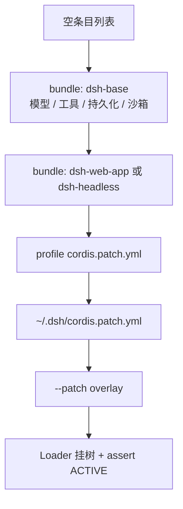

`dsh web` = `--profile web` = base + web-app。  
`dsh --profile headless` = base + headless。  
一条 patch 按 `id` **整份替换** config，不是 deep-merge。

```sh
cd ../deepseek-harness
pnpm dsh --profile web --dump-config
```

---

## 3. 核心脊柱

`agent-loop` 是仓库里**唯一**的具体循环。它只依赖五个接口服务。

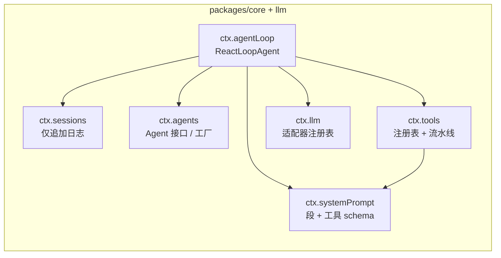

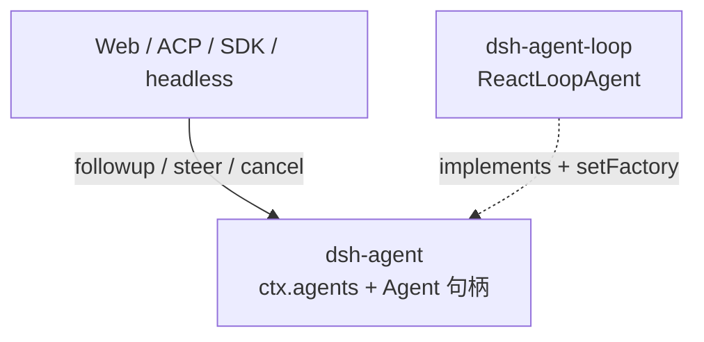

扩展插件依赖 `dsh-agent`，**不** import `ReactLoopAgent`。

---

## 4. 一轮对话：turn / step / Round

```text
Round     策略层一次迭代（Goal Round / Ralph Round）
  └─ 轮次  对已接纳输入的一次排空，直到 idle
       └─ 步骤  一次模型请求 + 它引发的工具执行
```

```mermaid
sequenceDiagram
  actor User
  participant Inbox
  participant Loop as agent-loop
  participant Hooks as waterfalls
  participant Prompt as systemPrompt
  participant LLM as ctx.llm
  participant Tools as ctx.tools
  participant Log as session log

  User->>Inbox: followup()
  Inbox->>Loop: wake
  Loop->>Log: turn/start
  Loop->>Inbox: claim next-step + one next-turn
  Loop->>Hooks: agent/pre-step
  alt reject or enter empty
    Loop->>Log: turn/end without step
  else enter(messages)
    Loop->>Log: step/start
    Loop->>Log: user/message
    Loop->>Prompt: assemble
    Loop->>Hooks: agent/request
    Loop->>LLM: llm/stream
    LLM-->>Log: assistant/chunk*
    Loop->>Log: assistant/message
    opt tool-call
      Loop->>Log: tool/call
      Loop->>Tools: execute pipeline
      Loop->>Log: tool/result
    end
    Loop->>Log: step/end
    opt more work
      Loop->>Loop: next step
    end
    Loop->>Hooks: agent/turn-stopping
    Loop->>Log: turn/end
  end
```

| 方法 | inbox | 唤醒？ |
|---|---|---|
| `followup()` | `next-turn` | 是 |
| `steer()` | `next-step` | 是 |
| `inject()` | `next-step` | 否 |

---

## 5. 三类事件

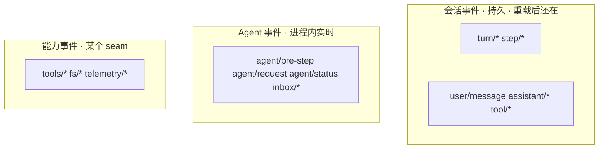

名字陷阱：`tools/result` 是注册表实时观察；`tool/result` 是写入日志的持久结果。

---

## 6. 日志是真源，surface 才进模型

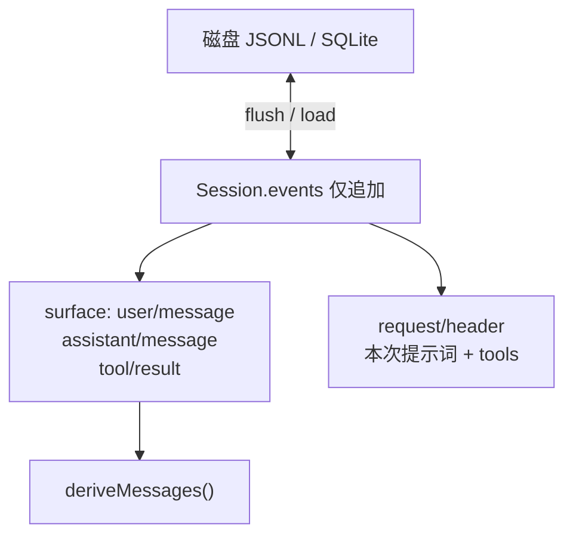

**模型可见 ⟺ 已记录。** 人类完整 transcript 读 append-origin 事件，不读被 replace 盖住的窗口。

---

## 7. 工具流水线（在 loop 外面）

```mermaid
flowchart TD
  call["session: tool/call"]
  pre["tools/pre-execute<br/>allow / deny / ask"]
  ask{"kind = ask?"}
  approval["ctx.approval"]
  guard["ctx.tools.guard()<br/>单调最终拒绝"]
  around["tools/execute<br/>超时 / 重试 / 指标"]
  body["tool execute()"]
  post["tools/post-execute<br/>换内容或换值"]
  fin["finalizeContent"]
  obs["tools/result 只观察"]
  logged["session: tool/result"]
  deny["当拒绝处理"]
  call --> pre --> ask
  ask -->|yes| approval
  approval -->|允许一次| guard
  approval -->|拒绝或无人应答| deny
  ask -->|allow| guard
  ask -->|deny| deny
  guard --> around --> body --> post --> fin --> obs --> logged
  deny --> post
```

权限挂 `pre-execute`，不要写进某个工具的 `execute`。没挂审批时 `ask` 退化成拒绝。

---

## 8. Capability seam

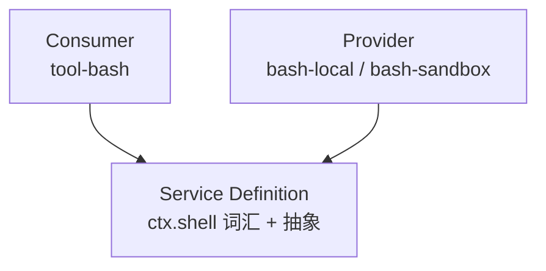

规范范例：`packages/shell`。扩展只依赖 Definition。

---

## 9. 想加 X 挂哪

| 想做 | 挂哪 |
|---|---|
| 新模型提供方 | `ctx.llm.registerAdapter` |
| 新面向模型的能力 | `ctx.tools.register` |
| 某会话不同工具集 | agent preset + `isolate` |
| 新 shell 后端 | 注册 `ctx.shell` |
| 人类斜杠命令 | `ctx.commands` |
| 拦截请求 / 工具 / 轮次 | `agent/*` 或 `tools/*` |
| 给模型塞上下文 | `agent.inject()`，且能从日志重建 |
| 新的持久事实 | 扩 `SessionEventMap` |
| 按 agent 定制 | `agent.ctx` |

---

## 10. 四条「继续干活」不要混

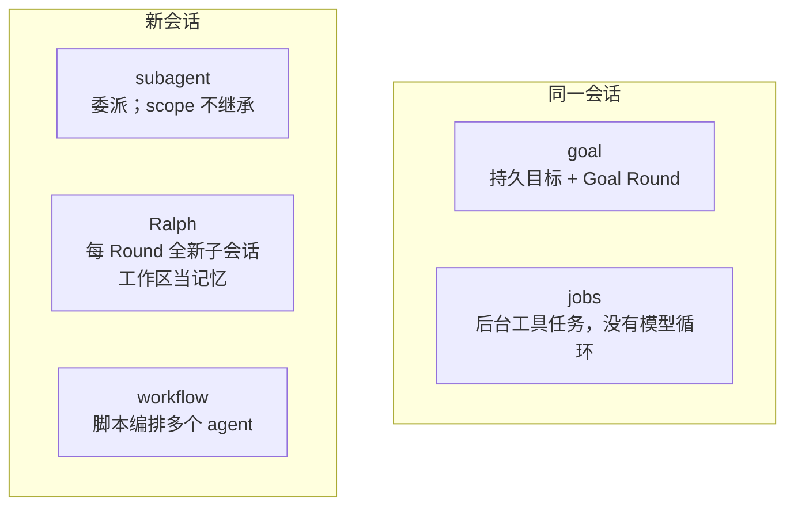

---

## 11. Cordis Fiber

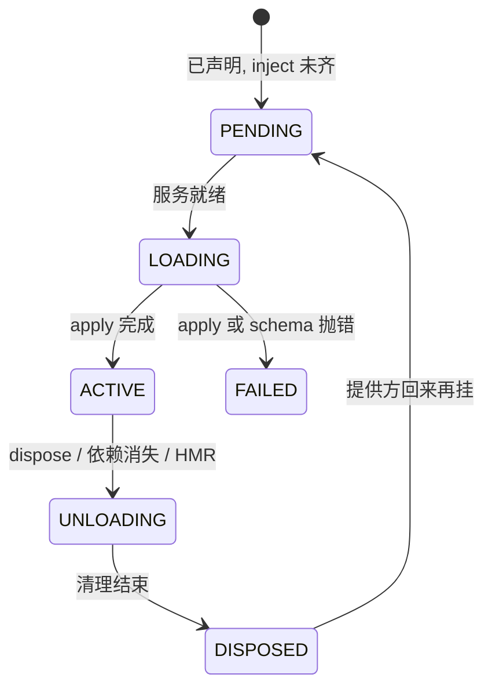

教程启动器里 PENDING 可以静默退出。产品 `boot()` 会把「启用了却 PENDING」升级成启动失败。

---

## 12. 四种分发

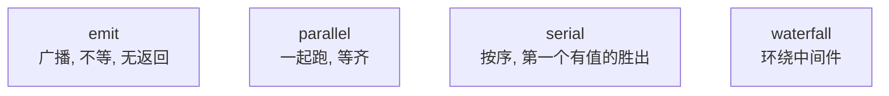

waterfall 像洋葱：

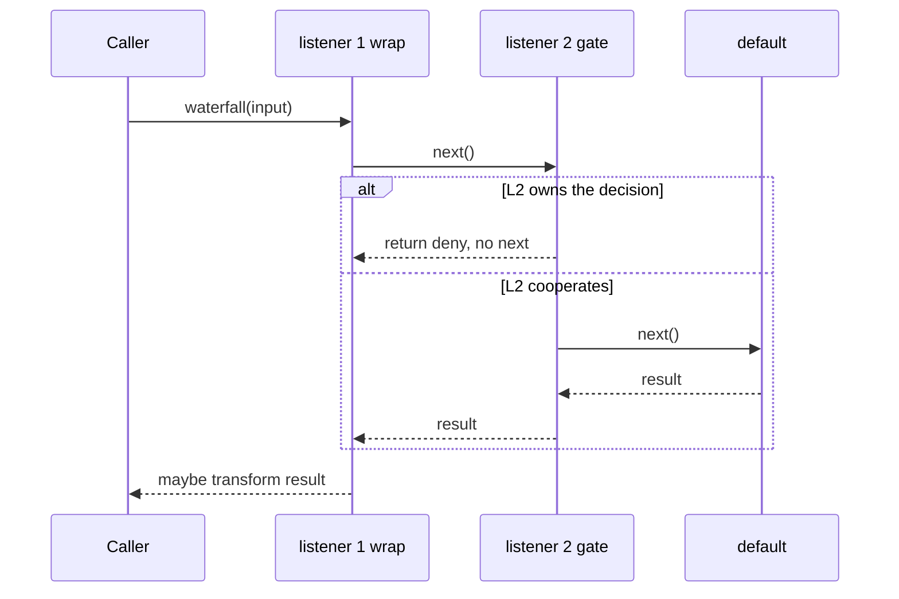

观察者必须 `next()`。不调用 = 有意短路。

---

## 13. 产品 patch 怎么插进去

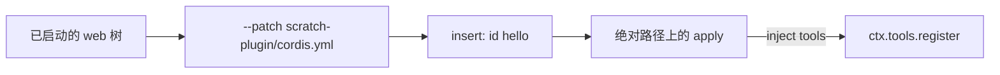

`name` 必须是绝对路径。相对路径会按 profile 目录解析，找不到你的练习文件。

---

## 14. scope 不是谱系

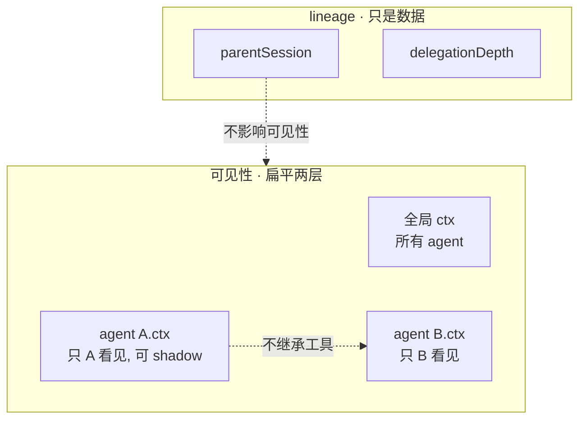

第 3 天先当扁平两层。preset 父链是后话。

---

## 15. 两个 inbox

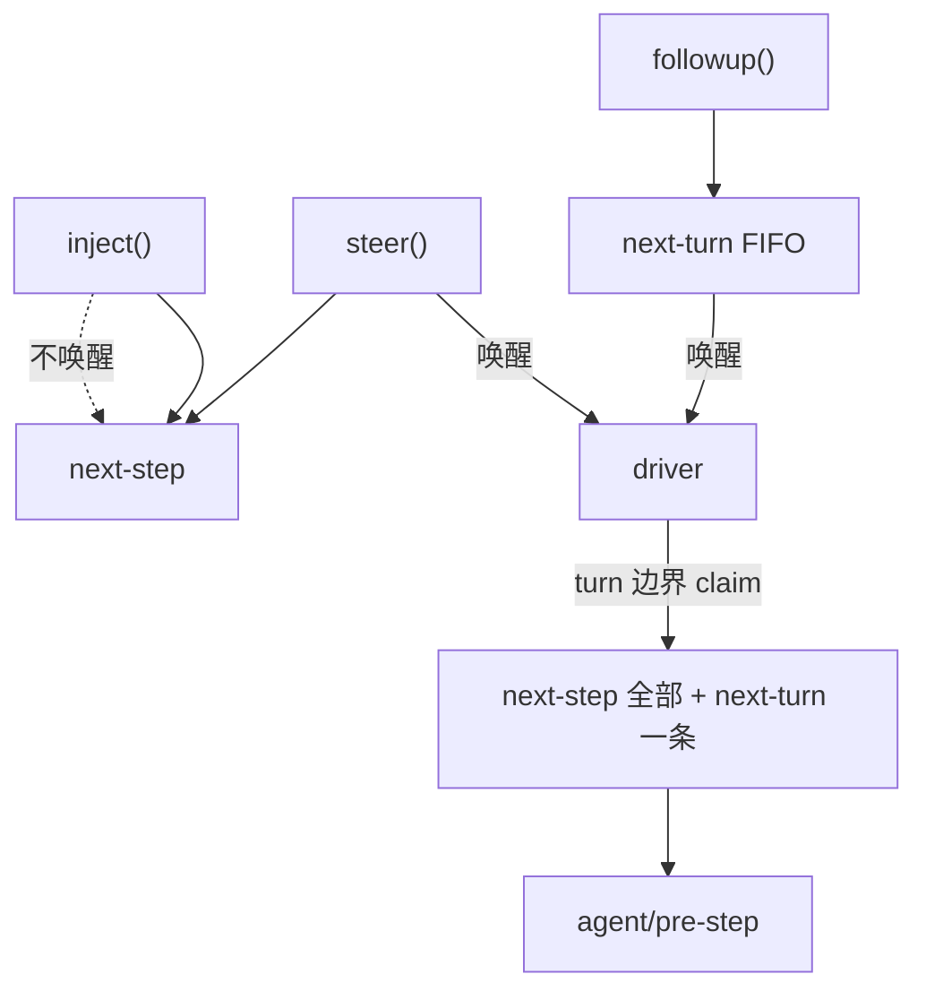

领取是纯删除。`pre-step` 拒绝后消息不会回到 inbox，但会留下一个不含步骤的轮次。

---

## 16. 一次 assemble

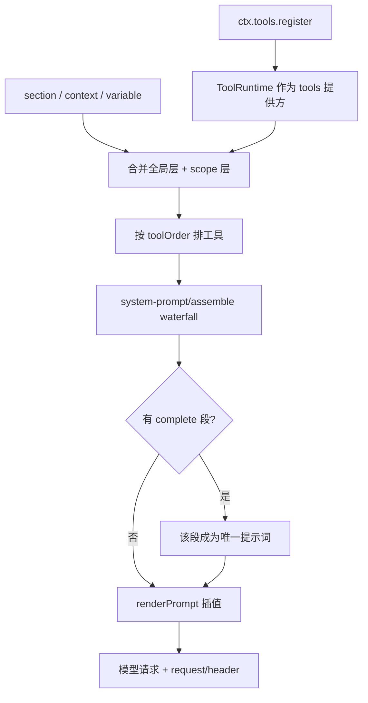

`request/header` 没有 `surfaceOp`，不进 `deriveMessages()`。

---

## 17. 创建与恢复 agent

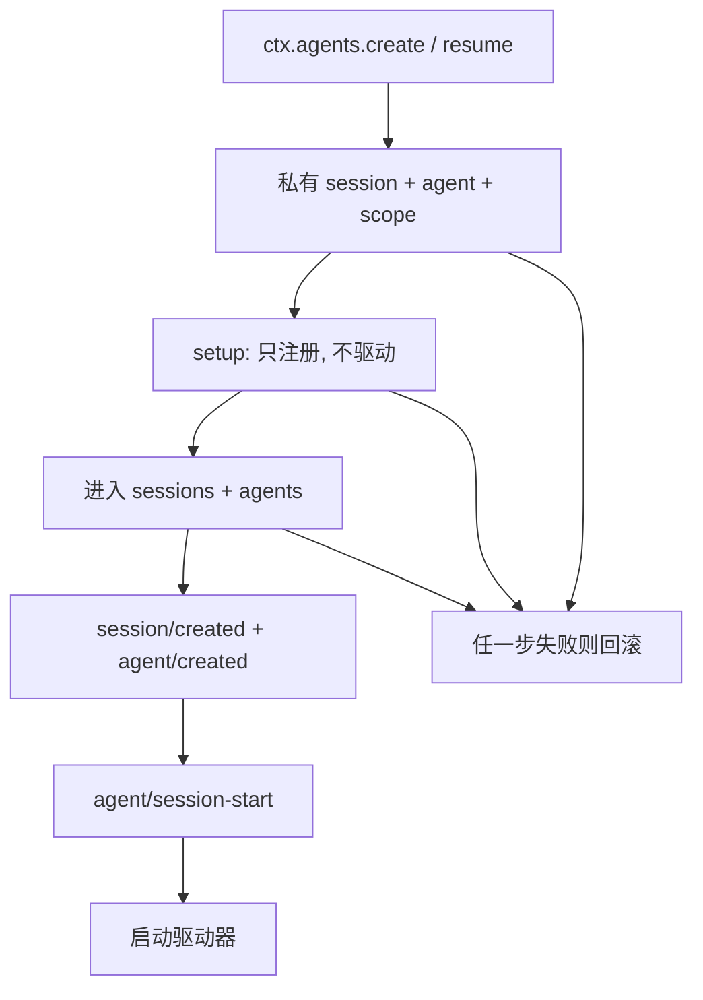

setup 里调用 `followup` 是协议错误。

---

## 18. chunk 如何变成一条 assistant 消息

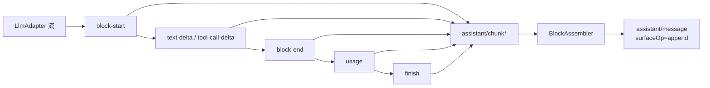

模型历史只要最终 `assistant/message`。UI 回放 token 流读 chunk。

---

## 19. 从 `dsh web` 到第一轮

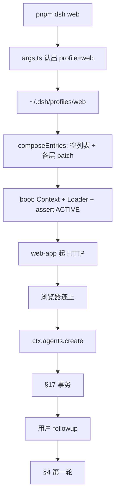

headless 把「浏览器」换成 runner：命令行字符串当第一条 followup，等 idle，打印，退出。

---

## 20. 执行世界一起搬走

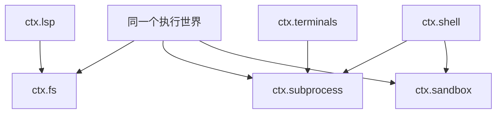

把 fs + subprocess 指到远程沙箱，Bash / PTY / LSP 跟着走，不必给每个工具写远程版。

---

## 21. compaction 改窗口

```mermaid
flowchart TB
  log["原始 Session.events 仍在"]
  old["旧 surface 段"]
  neu["新 surface 节点<br/>surfaceOp = replace"]
  model["deriveMessages 只看见新窗口"]
  human["人类 transcript 读 append-origin"]
  log --> old
  log --> neu
  neu -->|"盖住"| old
  neu --> model
  log --> human
```

触发点：`agent/pre-step` 压力、`agent/request-error` 溢出、手动。不进 loop 本体。

---

## 22. 人类通道与模型通道

```mermaid
flowchart TB
  human["人类输入"]
  slash["以 / 开头?"]
  cmd["ctx.commands<br/>不进模型消息"]
  ui["默认只是 UI 状态"]
  domain["处理器也可改 goals 等持久领域"]
  follow["agent.followup"]
  model["模型 tool-call"]
  pipe["ctx.tools.execute"]
  ask["pre-execute ask"]
  appr["ctx.approval"]
  human --> slash
  slash -->|yes| cmd --> ui
  cmd --> domain
  slash -->|no| follow
  model --> pipe --> ask --> appr
```

`/goal` 是人类命令。模型侧另有 goal 工具。领域只有一份。

---

## 23. 产品表面都是适配器

```mermaid
flowchart TB
  core["同一套 loop + 日志 + 工具"]
  web["Web GUI<br/>host + client"]
  acp["ACP stdio"]
  sdk["JSON-RPC SDK"]
  py["Python SDK"]
  hd["headless runner"]
  web --> core
  acp --> core
  sdk --> core
  py --> core
  hd --> core
```

所有表面都做两件事：外部输入变成 `followup` / `steer` / `cancel`；从 `session/event` 和 `agent/*` 渲染出去。不要从 `packages/client` 学循环。

---

## 24. 一份短日志长什么样

[text-turn](https://github.com/deepseek-ai/deepseek-harness/blob/47f943859b/examples/jsonrpc-agent/tests/snapshots/text-turn/session.jsonl) 的骨架（类型，不是全文）：

```mermaid
flowchart TD
  h["session header"] --> s0["inbox/spliced 插入用户句"]
  s0 --> t1["turn/start"]
  t1 --> s1["inbox/spliced 领取删除"]
  s1 --> st["step/start"]
  st --> um["user/message surface"]
  um --> rh["request/header 不进 surface"]
  rh --> ck["assistant/chunk *"]
  ck --> am["assistant/message surface"]
  am --> se["step/end"]
  se --> te["turn/end"]
```

带工具时在 `assistant/message` 和 `step/end` 之间插入 `tool/call` → `tool/result`。见 [bash-tool](https://github.com/deepseek-ai/deepseek-harness/blob/47f943859b/examples/jsonrpc-agent/tests/snapshots/bash-tool/session.jsonl) 和 [walkthrough](./walkthrough.md)。

真实 jsonl 里 `assistant/chunk` 旁边还有 `reasoning-chunks` / `text-chunks` / `tool-call-chunks`：那是压缩过的流式块，标出来即可，**不是** surface。

---

## 25. 并行工具如何保序

```mermaid
sequenceDiagram
  participant M as 模型顺序: A then B
  participant Pool as 滚动池
  participant Log as session
  M->>Pool: start A, start B
  Pool-->>Log: tool/call A
  Pool-->>Log: tool/call B
  Note over Pool: B 先跑完也先不写 result
  Pool-->>Log: tool/result A
  Pool-->>Log: tool/result B
```

`isConcurrencySafe === true` 才进池。写回顺序跟模型给出的 call 顺序，不是完成顺序。

---

## 26. HMR 在干什么

```mermaid
flowchart LR
  save["保存插件.ts"] --> un["unload: 跑全部 disposer"]
  un --> load["load: 再 apply"]
  load --> same["依赖 inject 的插件跟着卸/挂"]
```

所以 `setInterval` 必须在 `ctx.effect` 里。HMR 不是「热补丁函数」，是整棵 fiber 拆掉再挂。

---

## 27. 同一句「把测试修绿」四条路

```mermaid
flowchart TB
  job["用户: 把测试修绿"]
  job --> g["goal: 同会话盯着修<br/>人类轮次不耗 Goal Round"]
  job --> s["subagent: 新会话去做<br/>父窗口不被中间步骤撑爆"]
  job --> r["Ralph: 每 Round 全新 agent<br/>工作区当记忆"]
  job --> w["workflow: 脚本扇出<br/>测很多包 / 很多角度"]
```

选错的典型症状：用 Ralph 当普通续聊；用 goal 当「另开一个干净上下文」；用 workflow 只委派一次。

---

## 28. 和其他 harness 的形状

```mermaid
flowchart TB
  task["拦一次 bash"]
  task --> pi["Pi: 扩展里的钩子"]
  task --> cx["Codex: hooks 文件"]
  task --> dsh["dsh: tools/pre-execute 插件"]
```

完整对照：[compare.md](./compare.md)。
