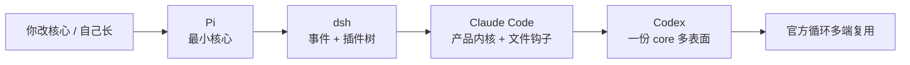
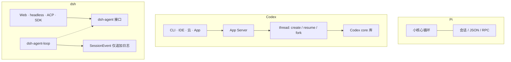
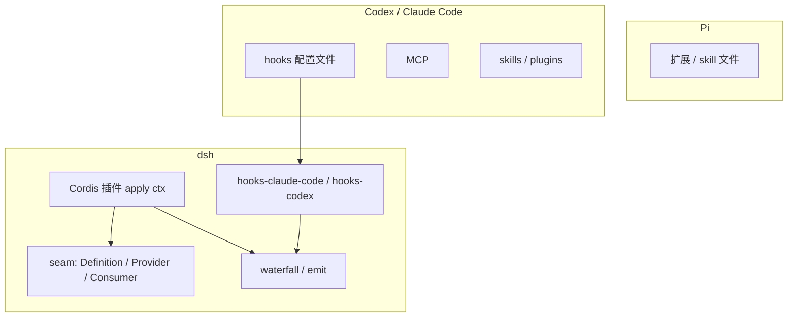
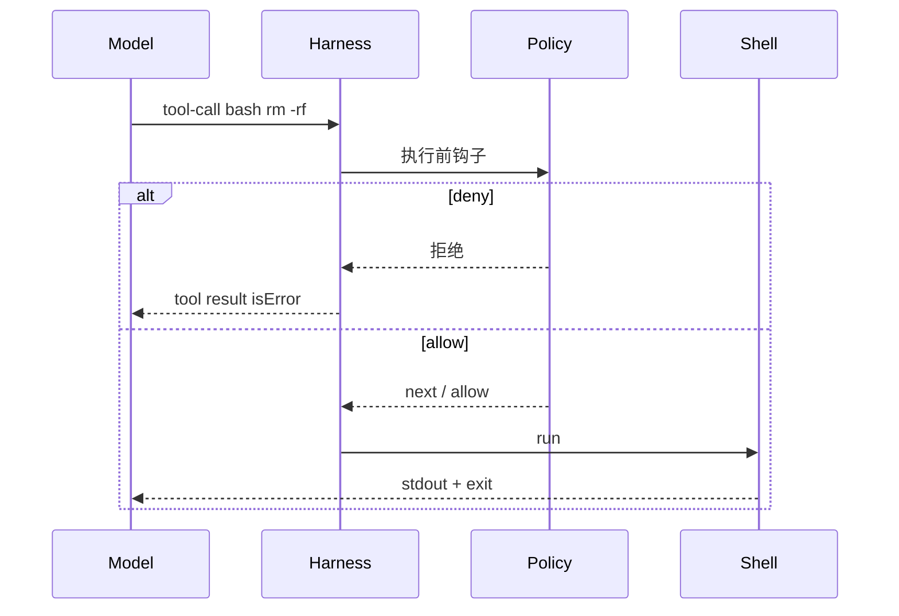
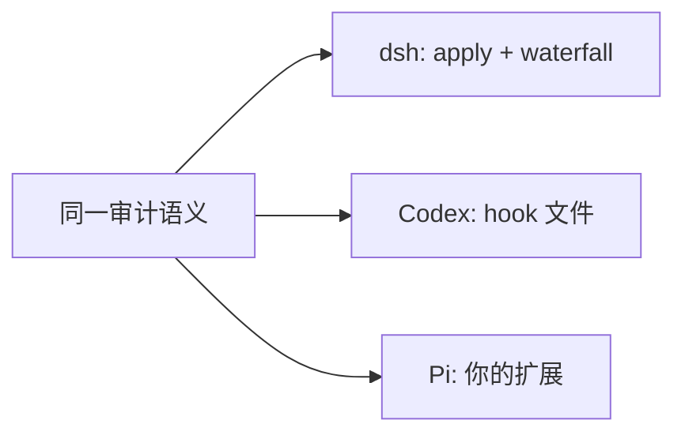
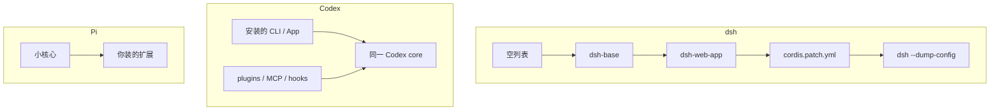

# 和其他 harness 比什么

学 dsh 时很容易拿它跟 **Pi**、**Codex**、**Claude Code** 对号入座。它们都叫 harness：把模型、工具、会话和 UI 箍成一个能干活的 agent。差别不在「有没有循环」，而在**循环放哪、扩展怎么挂、日志是不是真源**。

对照本课：[architecture.md](./architecture.md) · [walkthrough.md](./walkthrough.md)。  
上游：Pi <https://pi.dev/> · [earendil-works/pi](https://github.com/earendil-works/pi)；Codex [Unlocking the Codex harness](https://openai.com/index/unlocking-the-codex-harness/)；Claude Code / Codex 在 dsh 里是 hook 桥和 subagent 提供方，不是再实现一套循环。

**不要和 `dsh-llm-pi-ai` 搞混。** 那是 dsh 的一个 **LLM 适配器包**（接 Pi API），不是 Mario Zechner 的 Pi coding agent。

---

## 一句话定位

| Harness | 一句话 | 扩展单位 | 循环在哪 |
|---|---|---|---|
| **Pi** | 最小终端 harness：模型 + 提示词 + 少量工具，适应你的工作流 | 扩展 / skill，核心故意很小 | 小核心（`pi-agent-core`） |
| **Codex** | 一份 Rust **Codex core** 驱动 CLI、IDE、云、App | Skills、plugins、hooks、MCP、subagents | 共享库 + App Server 托管多个 thread |
| **Claude Code** | 终端原生编码 agent，项目级 `CLAUDE.md` + hooks 文件 | hooks 文件、MCP、skills | 产品内核（闭源为主） |
| **dsh** | 一切皆插件；会话日志是真源；loop 可替换 | Cordis 插件 + capability seam | `dsh-agent-loop`，接口是 `dsh-agent` |



越往左：你改的是小核心或自己的扩展。  
越往右：一份官方循环被很多客户端复用。  
dsh 站在中间偏左：**内核很小（事件 + 服务），但发行组合很厚**（base bundle 已经挂满工具、沙箱、持久化）。

---

## 哲学

**Pi** 的公开立场是：agent 没有那么特殊，差别主要在 UI 和你怎么长它。默认工具很少，系统提示词短，鼓励 fork / 写扩展，而不是先装一个「全能 IDE agent」。

**Codex** 的公开立场是：所有表面跑**同一套** harness（循环、thread 生命周期、鉴权、沙箱工具执行）。CLI 只是其中一个客户端。App Server 用 JSON-RPC 连上 core，一个进程里可以有多条 thread。

**Claude Code** 把「项目怎么教模型」放进仓库文件（`CLAUDE.md`）和 hooks 配置，循环本身不对外拆成可替换驱动器。

**dsh** 的公开立场是：没有特权内核。模型适配器、工具表、会话日志、**agent loop 本身**都是插件。新行为挂文档化扩展点。同时它比 Pi 更「产品」：profile / bundle、Web GUI、审批、goal / Ralph / workflow 都是发行层就有的。

---

## 循环和会话



| | Pi | Codex | dsh |
|---|---|---|---|
| 循环能否换 | 核心小，换等于换/fork 核心 | 各表面共用一份 core，不按表面分叉循环 | **可以**：依赖 `ctx.agents`，不 import 驱动器 |
| 会话真源 | 会话文件 / 流，以产品实现为准 | thread 事件史，客户端重连按同一时间线渲染 | **仅追加 `SessionEvent`**；`deriveMessages()` 投影模型窗口 |
| 多表面 | TUI 为主；另有 print / RPC / SDK | **刻意**一份 harness 多客户端 | 同一套 loop，表面是适配器（[architecture §23](./architecture.md#23-产品表面都是适配器)） |

dsh 多出来的硬约定：**模型可见 ⟺ 已记录**。Codex / Pi 也持久化对话，但不把「新模型可见输入必须先成为日志事件」写成和 loop 同级的不变量。

---

## 扩展怎么挂



| | 你加一个「每次 bash 前审计」 |
|---|---|
| Pi | 写扩展，挂进它的工具/事件钩子（API 以 Pi 文档为准） |
| Codex / Claude Code | 写 hook 配置（或插件），由产品映射到生命周期 |
| dsh | 普通插件：`ctx.on('tools/pre-execute', …)`，必须 `next()` |

dsh **已经能跑别人的 hook 文件**：`dsh-hooks-claude-code` / `dsh-hooks-codex` 把外部 hook 映射到 `agent/pre-step`、`tools/pre-execute` 等原生点。学 dsh 时优先写原生插件；桥是兼容层。

dsh 也能把一轮委派给 **Codex / Claude Code 当 subagent 后端**（`dsh-subagent-codex`、`dsh-subagent-claude-code`）。那是「dsh 当编排，别人当工人」，不是三种循环熔成一个。

---

## 工具、沙箱、组合

| | Pi | Codex | dsh |
|---|---|---|---|
| 默认工具面 | 很少，鼓励你加 | 编码工具 + MCP + skills，面比较全 | 发行 bundle 已挂 bash / fs / web / skill / job… |
| 换执行后端 | 扩自己的工具 | 沙箱是产品能力（Seatbelt / bwrap+Landlock / Windows） | **seam**：换 `ctx.shell` / `ctx.fs` / `ctx.sandbox`，Consumer 不改 |
| 怎么组装一棵运行树 | 配置 + 扩展 | 产品安装 + 插件市场 + 项目文件 | **profile + bundle + patch**（`dump-config` 可见） |
| 权限 / 审批 | 视扩展 | 产品策略 + sandbox 默认偏紧 | `pre-execute` + `ctx.approval` + permission presets |

Pi 赢在「默认不替你做主」。  
Codex 赢在「一份 core、多端一致、沙箱按内核做」。  
dsh 赢在「换后端不必 fork 循环，组合可以用 YAML 叠出来」。

---

## 多智能体

| | 做法 |
|---|---|
| Pi | 核心不管「官方 subagent 产品」；社区用扩展堆 |
| Codex | 产品级 subagents + 同一 core 上的多 thread |
| dsh | **好几条语义不同的机制**：subagent / goal / Ralph / workflow / jobs。scope **不**继承。见 [day-10](./day-10.md) |

不要把 Codex 的 thread 和 dsh 的 Goal Round、Ralph Round 当成同一个词。

---

## 什么时候用哪个

```mermaid
flowchart TD
  start{"主要目标是什么?"}
  start -->|一份官方循环跑 CLI + IDE + 云| product{"接受哪家产品形状?"}
  start -->|自己掌控循环和扩展| control{"要改的是小循环还是产品树?"}
  start -->|已有 Codex / Claude，只要它们干活| dshBridge["dsh + subagent-codex<br/>或 subagent-claude-code"]
  product -->|OpenAI 产品形状| cx["Codex"]
  product -->|项目已是 Claude Code| cc["Claude Code"]
  control -->|小循环 / 自己长工具| pi["Pi"]
  control -->|可换后端 / 可换 loop / YAML 组合| dsh["dsh"]
```



- 想读「最小 harness 长什么样」→ 读 Pi，再回看 dsh 的 Cordis 五概念，会发现 dsh 把同一套东西拆成了可卸载插件。
- 想读「一个循环如何服务很多 UI」→ 读 Codex App Server，再对照 dsh 的 `dsh-agent` + Web/ACP/SDK。
- 想在 dsh 里接上已有 Codex/Claude 工作流 → hook 桥或 subagent 提供方，不要把循环抄进来。

---

## 学 dsh 时对照着记

学完第 3 天和第 6 天，用这张表自测：

| 问题 | dsh 的答案 | 若答成 Pi / Codex 的形状就回去重读 |
|---|---|---|
| 新工具挂哪？ | `ctx.tools.register`，schema 自动进 assemble | 只改提示词字符串 / 只改某个 CLI 内置表 |
| 新模型挂哪？ | `ctx.llm.registerAdapter` | 写死 OpenAI 或某个 TUI 配置键 |
| 拦一次 bash？ | `tools/pre-execute` | 改 `tool-bash` 的 `execute` |
| 会话重载后模型窗口？ | `deriveMessages()` 自日志 | 「内存里的 messages 数组」 |
| 换 UI？ | 新适配器听 `session/event`，调 `followup` | fork 循环 |

---

## 同一功能，三种挂法（示意图）

用户需求：**每次 `rm -rf` 先记审计，再决定是否允许。**



这条时序在三个产品里都成立。变的是 **Policy 长在哪**：

```ts
// dsh：普通插件，和 loop 无关
export const inject = ['tools']
export function apply(ctx: Context) {
  ctx.on('tools/pre-execute', async (exec, next) => {
    if (exec.name !== 'bash') return next()
    const cmd = String(exec.arguments.command ?? '')
    console.log('[audit]', cmd)
    if (cmd.includes('rm -rf')) {
      return { kind: 'deny', reason: 'rm -rf blocked in this lab.' }
    }
    return next()
  })
}
```

```yaml
# 概念示意：Codex / Claude Code 的 hook 文件。不要当可运行配置粘贴。
# 产品把 PreToolUse 映射到「执行前」；dsh 的 hooks-codex 再映射到 pre-execute
hooks:
  PreToolUse:
    - matcher: bash
      command: ./scripts/audit-bash.sh
```

```text
Pi：在扩展里注册「tool 执行前」回调（API 以 Pi 文档为准）。
核心不预置一套和 dsh 对等的 waterfall 目录。
```



---

## 组合一棵树：dump-config vs 产品安装



例子：把默认 bash 换成沙箱 bash。

- **dsh**：profile patch 里 disable `bash-local` 那一行，启用 `bash-sandbox`。`tool-bash` 不用改。
- **Codex**：改沙箱模式 / 策略，不换「bash 工具包」。
- **Pi**：换你自己写的 shell 扩展实现。

---

## 多表面：Codex App Server ≈ dsh 的 agents 接口

```mermaid
sequenceDiagram
  participant IDE
  participant Gate as App Server / Host
  participant Loop as core / agent-loop
  participant Log
  IDE->>Gate: 用户输入
  Gate->>Loop: submit / followup
  Loop->>Log: 持久事件
  Log-->>Gate: 流式更新
  Gate-->>IDE: 渲染
```

读 Codex 的 App Server 文章时，把「thread」对到 dsh 的 **session + agent**，把「client」对到 **Web / ACP / SDK**。不要对到 Ralph Round。

---

## 例子：一句话任务，四个产品会怎么走

「在仓库里修红测试，另开干净上下文，别把我当前聊天撑爆。」

| 产品 | 典型走法 |
|---|---|
| Pi | 当前会话里直接干，或你自己写的「spawn」扩展 |
| Codex | 产品 subagent / 另一条 thread |
| Claude Code | 当前会话或 Task 类委派（以产品为准） |
| dsh | **`subagent`**（新会话、scope 不继承）。不是 goal，不是 Ralph |

「就在这窗里盯着修，直到绿。」→ dsh 用 **goal**。Pi / Codex 通常就是同一条对话继续。

---

## 资料

- Pi：<https://pi.dev/> · [GitHub](https://github.com/earendil-works/pi) · [作者笔记](https://mariozechner.at/posts/2025-11-30-pi-coding-agent/)
- Codex：[Unlocking the Codex harness](https://openai.com/index/unlocking-the-codex-harness/) · [Harness engineering](https://openai.com/index/harness-engineering/) · [codex-rs/core](https://github.com/openai/codex/tree/main/codex-rs/core)
- dsh 本课：[architecture](./architecture.md) · [day-06](./day-06.md) · [day-08](./day-08.md) · [day-10](./day-10.md) · [day-11](./day-11.md)
