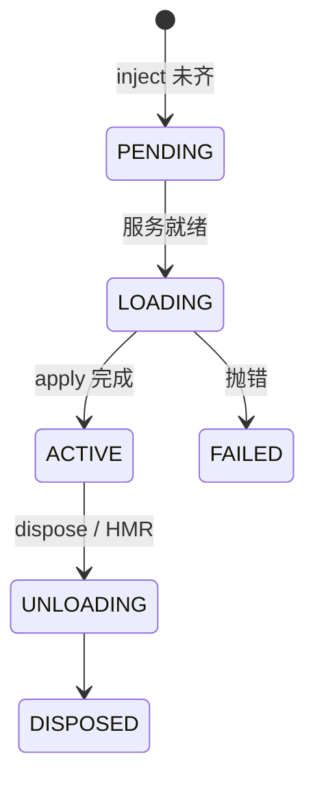
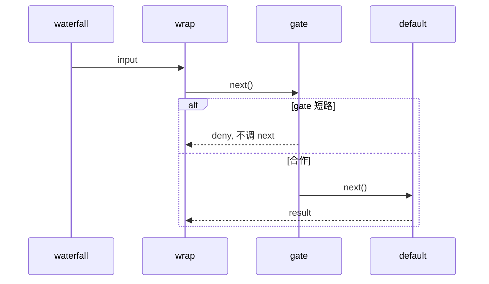

# 第 1 天 · 跑起来 + Cordis 入门

**对应阶段：** 0 + Cordis 教程 01–04  
**时长：** 4–5 小时  
**今天结束时你能：** 启动 dsh、看懂一条 dump-config 条目、亲手写一个带服务和 waterfall 的插件。

命令都从**本仓库根**（`learn/`）起算。上游检出必须在旁边：`../deepseek-harness/`。

## 时间表

| 时段 | 内容 |
|---|---|
| 0:00–1:00 | 安装、启动 Web、dump-config |
| 1:00–1:20 | 五个 Cordis 概念 |
| 1:20–4:20 | 官方教程 01–04（对照做，不要在本页重抄） |
| 4:20–5:00 | 过关 + 笔记 |

---

## 一、先当产品用一次

不要一上来就钻 `packages/`。先确认三件事：它能跑、它是一棵插件树、树可以从配置看到。

### 1. 安装

```sh
cd ../deepseek-harness
pnpm install
pnpm run build
```

需要 Node `^22.19 || >=24`。第一次 `install` + `build` 可能要十几分钟。源码启动走 `tsx`；先 `build` 一次，后面 dump-config / headless 更稳。

### 2. 启动 Web

```sh
pnpm dsh web
```

浏览器打开终端打印的地址，默认 `http://127.0.0.1:3080`。这是 `--profile web` 的别名。

界面起来之后还要两步，否则输入框是灰的（官方 [Web UI 指南](https://github.com/deepseek-ai/deepseek-harness/blob/47f943859b/docs/user/guide/index.zh.md)）：

1. **选择工作区** — 选启动 `dsh` 时所在的目录（或任意练习目录）。
2. **设置 → 模型** — 有 `DEEPSEEK_API_KEY` 再填。没 key 也能看界面，今天不要求对话。

另开一个终端（仍在 harness 根）：

```sh
pnpm dsh --profile web --dump-config | less
```

每一条大致是：

```yaml
- id: tools
  name: '@deepseek-ai/dsh-tools'
  config:
    mode: native
```

在 dump 里找出：`session` / `system-prompt` / `tools` / `llm` / `agent-loop`。找不到就搜 `dsh-session`、`dsh-tools`、`dsh-agent-loop`。今天只要求认得出。

### 3. 两个入口差在哪

| 命令 | 实际含义 |
|---|---|
| `dsh web` | `--profile web`：base + web-app |
| `dsh --profile headless "任务"` | base + headless，跑完就退出 |

图见 [architecture.md §2](./architecture.md)。第 7 天再 diff。

有 key 时（放在 harness 根的 `.env`，不要放进本仓库）：

```sh
pnpm dsh --profile headless "用一句话介绍你自己"
```

没 key 就跳过。

对照：[上游 README](https://github.com/deepseek-ai/deepseek-harness/blob/47f943859b/README.zh.md)、[cli README](https://github.com/deepseek-ai/deepseek-harness/blob/47f943859b/apps/cli/README.md) 前半。

### 启动失败时

| 现象 | 先查 |
|---|---|
| `pnpm` 找不到 / 引擎不符 | Node 是否 `^22.19 \|\| >=24` |
| `dsh web` 端口占用 | 终端里的实际地址；或换 `--port` |
| 页面有、输入框不能用 | 没选工作区 |
| dump-config 很慢或报错 | 是否在 harness 根、是否先 `build` |
| 配置了 key 仍不能聊 | 设置 → 模型是否保存成功 |

---

## 二、Cordis：后面所有包都是这个模型

dsh 没有「内核 + 插件」。**运行时本身就是插件树。** 今天不要读 `vendor/cordis`。

五个概念：

1. **插件** = 常见是导出 `apply(ctx)` 的函数；也可以是对象或 `Service` 子类。
2. **上下文** = 服务容器。消费方用 `ctx.tools` 这类 key，不 import 具体实现。
3. **`inject`** 声明依赖。就绪前停在 PENDING。加载顺序由依赖决定，不是 YAML 行序。
4. **事件** 四种分发：`emit` / `waterfall` / `parallel` / `serial`。
5. **注册是可逆副作用。** Cordis 管不到的资源必须包进 `ctx.effect()`。

| 模式 | 等不等 | 返回值 | 典型用途 |
|---|---|---|---|
| `emit` | 否 | 否 | `session/event`、`tools/result` |
| `parallel` | 是 | 否 | `session/flush` |
| `serial` | 是 | 第一个有值的胜出 | `agent/turn-stopping` |
| `waterfall` | 监听器里 `await next()` | 是 | `agent/pre-step`、`tools/pre-execute` |

**Waterfall 铁律：** 只观察的监听器必须 `next()`。不调用 = 有意短路。





完整图：[architecture.md §11–12](./architecture.md#11-cordis-fiber)。

先读完 [primer](https://github.com/deepseek-ai/deepseek-harness/blob/47f943859b/docs/cordis-primer.zh.md)，再动手。

---

## 三、动手：官方教程 01–04

在 harness 检出里做，不要在本仓库里做：

```sh
cd ../deepseek-harness
mkdir -p tmp/cordis-tutorial
cd tmp/cordis-tutorial
```

每章同一条命令：

```sh
node --import tsx ../../vendor/cordis/bin.js
```

按官方章节做，做完对照下面的「留下什么」。不要跳章。

| 章 | 对照 | 留下什么 |
|---|---|---|
| 1 | [01-first-plugin](https://github.com/deepseek-ai/deepseek-harness/blob/47f943859b/docs/cordis-tutorial/01-first-plugin.zh.md) | `apply` 抛错会失败；**拼错模块路径往往不崩**，只打日志 |
| 2 | [02-lifecycle](https://github.com/deepseek-ai/deepseek-harness/blob/47f943859b/docs/cordis-tutorial/02-lifecycle-and-effects.zh.md) | fiber；`ctx.on` / `ctx.plugin` 已是 effect；异步 disposer 会并发，必须串行就放同一个 disposer |
| 3 | [03-services](https://github.com/deepseek-ai/deepseek-harness/blob/47f943859b/docs/cordis-tutorial/03-services.zh.md) | 交换 YAML 行序输出不变；删掉提供方，消费方 PENDING |
| 4 | [04-events](https://github.com/deepseek-ai/deepseek-harness/blob/47f943859b/docs/cordis-tutorial/04-events.zh.md) | waterfall-demo 输出 `HELLO` 和 `** BLOCKED **`；亲手推演第二行为什么大写 |

问自己：为什么 `setTimeout` 也要包进 `ctx.effect()`？（父插件先卸时，未触发的回调不能打在已死的应用上。）

---

## 四、过关测验

先自己答，再展开文末答案。

1. `dsh web` 和 `dsh --profile headless` 共享哪一层？差在哪一层？
2. dump-config 里一条 entry 的 `id` / `name` / `config` 各是什么？
3. 为什么不能在 `apply` 里裸写 `setInterval`？
4. waterfall 监听器忘了 `next()` 会怎样？权限门禁什么时候应该故意不调用？
5. `inject: ['tools']` 的插件，在 `tools` 被卸载时会发生什么？
6. 模块路径拼错和 `apply` 抛错，失败表现有何不同？

## 五、作业

写仓库根的 [01-跑起来.md](../01-跑起来.md)。至少记下：`~/.dsh` 是否出现、dump-config 里认出的 5 个服务、waterfall 用自己的话复述一遍。

## 六、明日预告

配置 schema、`id` / HMR、PENDING，然后把一个工具 `--patch` 进 Web UI。

<details>
<summary>参考答案</summary>

1. 共享 `dsh-base`。差在最上层：`dsh-web-app` vs `dsh-headless`。
2. `id` 稳定身份；`name` 模块；`config` 交给该插件 schema 的选项。
3. 定时器不是 Cordis 管的。不包进 `ctx.effect()`，卸载后还在跑。
4. 链条短路，下游不跑。自己拥有最终决定时才故意不 `next()`。
5. 消费方被卸；`tools` 恢复后再加载。
6. `apply` 抛错：FAILED，启动器通常非零退出。模块解析失败：打日志，看起来像没加载。

</details>
