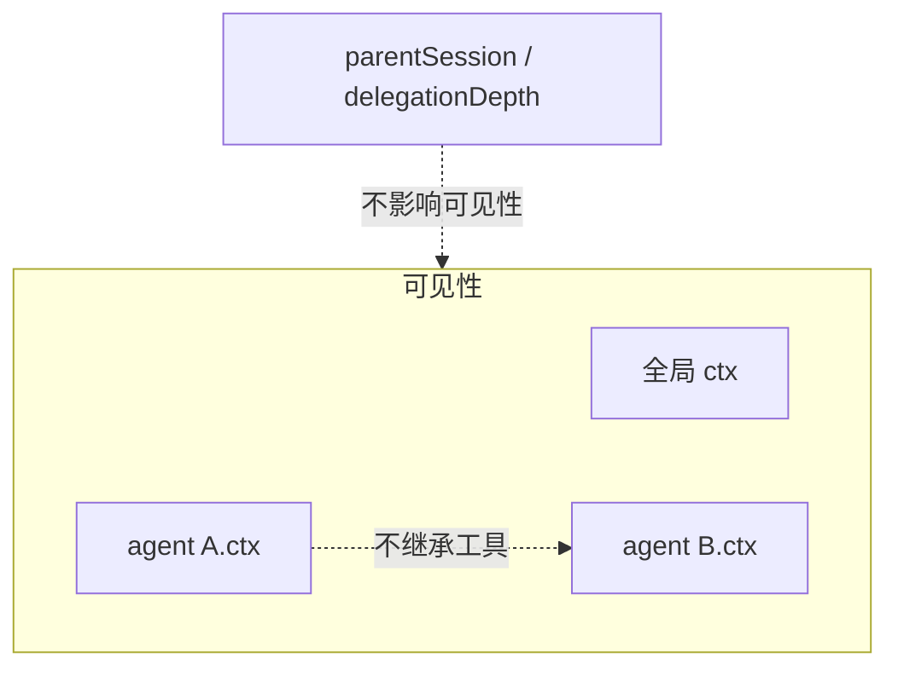

# 第 4 天 · scope 与 session

**对应阶段：** 3 上
**时长：** 5–6 小时
**今天结束时你能：** 解释 scope 不是权限、指出模型历史从哪三来、打开一份 jsonl 标出 header 和 surface 事件。

## 时间表

| 时段 | 内容 |
|---|---|
| 0:00–1:30 | scope：README + 子系统页 + `src/index.ts` 浏览 |
| 1:30–4:30 | session：README → types → surface → index |
| 4:30–5:30 | 读一份真实 jsonl 的前 20 行 |
| 5:30–6:00 | 过关 + 笔记 |

读代码节奏：包 README → 子系统页 → `src/`。不要一上来 grep。

---

## 一、scope：两层扁平的注册世界

对照：

- [`packages/core/scope/README.zh.md`](https://github.com/deepseek-ai/deepseek-harness/blob/47f943859b/packages/core/scope/README.zh.md)
- [`docs/subsystems/scope.zh.md`](https://github.com/deepseek-ai/deepseek-harness/blob/47f943859b/docs/subsystems/scope.zh.md)
- [`packages/core/scope/src/index.ts`](https://github.com/deepseek-ai/deepseek-harness/blob/47f943859b/packages/core/scope/src/index.ts)

### 它解决什么问题

每个 agent 要能拥有「只属于自己」的工具、提示词段、变量、监听器，并且 agent dispose 时这些注册一起消失。全局插件仍然对所有人可见。

先当扁平两层（第 3 天约定；preset 父链第 7 / 10 天再看）：

- **全局**：普通 `ctx` 上的注册，所有 agent 看得见（除非被 restrict）
- **带作用域**：`agent.ctx` 上的注册，只对这一个 agent 可见

没有「子 agent 自动继承父 agent 的工具」。父子关系是 **lineage 数据**（`parentSession`、`delegationDepth`），不影响可见性。第 10 天还会再考。



图：[architecture.md §14](./architecture.md#14-scope-不是谱系) · [§6](./architecture.md#6-日志是真源surface-才进模型) · [§15](./architecture.md#15-两个-inbox)。

### 四个配套概念

| 词 | 意思 |
|---|---|
| scope key | 不透明标识，按对象同一性比较。约定：一个活跃 agent 就是自己的 key |
| `agent.ctx` | 带作用域的上下文。注册的可见性和生命周期是同一件事 |
| shadowing | 同名时，带作用域的盖住全局的。用来定制 persona / 工具变体 |
| restriction | `tools.restrict` 先过滤全局集合（多个取交集），再合并 scope-local 注册。被滤掉的全局工具：提示词里没有，执行也当不存在 |

scope **不是沙箱，也不是权限边界**。它只路由受信任的同进程插件。权限走 `tools/pre-execute` / approval。

### 分发规则（读事件时用）

关于某个 agent 活动的事件，用该 agent 的 **scope carrier** 分发：放行无标签监听器 + 该 agent 自己的监听器。

关于注册表本身的事件（「一个工具被添加了」）是**注册表主体**事件，不过滤。

`createScope(ctx, key)` 创建带标签的上下文。通过它做的每项注册，fiber 卸掉就撤销。

`setup` 窗口（第 6 天会再见到）：创建时 agent 和 scope 已经在，但还没发布、还没 `agent/session-start`。setup **只注册，不驱动**。

浏览 `src/index.ts` 时盯这些导出：`createScope`、`scopeOf`、`scopeTarget`、`ScopedLayers`。`ScopedLayers.peek()` 故意不看祖先链——限制和守卫是「我自己的贡献」，不能悄悄继承。

---

## 二、session：仅追加日志是真源

对照：

- [`packages/core/session/README.zh.md`](https://github.com/deepseek-ai/deepseek-harness/blob/47f943859b/packages/core/session/README.zh.md)
- [`docs/subsystems/session.zh.md`](https://github.com/deepseek-ai/deepseek-harness/blob/47f943859b/docs/subsystems/session.zh.md)
- 源码按这个顺序：
  1. [`src/types.ts`](https://github.com/deepseek-ai/deepseek-harness/blob/47f943859b/packages/core/session/src/types.ts)
  2. [`src/surface.ts`](https://github.com/deepseek-ai/deepseek-harness/blob/47f943859b/packages/core/session/src/surface.ts)
  3. [`src/index.ts`](https://github.com/deepseek-ai/deepseek-harness/blob/47f943859b/packages/core/session/src/index.ts)

`dsh-session` **不负责落盘**。它是内存里的事件存储。持久化是另一个 seam（第 9 天）。插件听 `session/event`，在 `session/flush` 时把副本写出去。

### SessionHeader：日志旁边的元数据

创建时写入，不在事件流里。今天要认识的字段：

| 字段 | 含义 |
|---|---|
| `version` | 磁盘格式版本。预览期钉在 `0`，旧运行时读不懂就拒绝，不迁移 |
| `id` | `SessionId`，品牌化 string |
| `createdAt` | 创建时间 |
| `cwd` | 工作目录 |
| `parentSession` | fork 自谁（lineage，不是 scope） |
| `seedLength` | 从前任继承了多少条事件 |
| `delegationDepth` | 子 agent 深度，必须持久，否则 resume 会变成顶层 |
| `agentPreset` | 用哪个 preset 组装。resume 必须恢复同一套工具和提示词 |

`SessionId` 是 `Branded<'SessionId'>`。跨边界不用裸 `string`。`SessionId('...')` 只是编译期铸型，无运行时开销。

### 日志里有什么

每条事件大致是：`type` + `seq` + `time` + `data`。`seq` 单调递增。

事件很多，今天按「是否进入模型历史」分成两堆：

**会进入模型历史的（surface 事件）只有三种：**

- `user/message`
- `assistant/message`
- `tool/result`

它们带 `surfaceOp`：`append` 接到末尾，或 `replace` 盖住一段旧 surface（压缩会用到）。

**不会进入模型历史、但日志里必须有的：**

- 边界：`turn/start` `turn/end` `step/start` `step/end`
- 流式保真：`assistant/chunk`（UI 回放、token 流）
- 工具过程：`tool/call`、以及工具自己追加的 `todo/write` 等
- 请求锚点：`request/header`（这次请求用的系统提示词、工具 schema、模型）
- inbox：`agent/inbox/spliced`（可从日志重建待处理队列）

`deriveMessages()` 只投影 surface。所以：

> 原始 `session.events` 是完整历史。
> `deriveMessages()` 是模型此刻该看到的消息数组。
> UI 回放 token 流要读 `assistant/chunk`，不能只读最终 `assistant/message`。

空内容的 `assistant/message` 仍会写入（保留 usage），但不进入派生历史。

### 为什么不把 chunk 也算进 surface

chunk 是同一条 assistant 消息的增量。surface 只要最终那条 `assistant/message`。`sourceEventSeqs` 把最终消息精确指回那些 chunk，回放时还能还原流。

### `append` 的纪律

`session.append(type, data)` 会快照并冻结 payload，校验后再提交，然后通知观察者。对已挂接会话重入 append 会被拒绝。这就是「模型可见 ⟺ 已记录」的牙齿：想让模型看见新东西，必须先能写成一种 `SessionEvent`。

`ctx.sessions.fork(source, boundary?)` 把截止到某个 seq 的前缀做成子会话种子，要求该前缀结束时没有开放轮次。

---

## 三、实验：读一份短 jsonl

今天用 **text-turn**（一次纯文本对话，约 20 行），不要用 advanced-toolchain（那份 `request/header` 会淹没你）。

[`examples/jsonrpc-agent/tests/snapshots/text-turn/session.jsonl`](https://github.com/deepseek-ai/deepseek-harness/blob/47f943859b/examples/jsonrpc-agent/tests/snapshots/text-turn/session.jsonl)

```sh
cd ../deepseek-harness
python3 -c '
import json
p="examples/jsonrpc-agent/tests/snapshots/text-turn/session.jsonl"
for i,line in enumerate(open(p)):
    o=json.loads(line)
    t=o.get("type", "?")
    seq=o.get("seq", "-")
    extra=""
    if t=="session": extra=f" id={str(o.get(\"id\",\"\"))[:8]}"
    data=o.get("data") or {}
    if t.endswith("/start") or t.endswith("/end"): extra+=f" {data}"
    if t in ("user/message","assistant/message","tool/result"): extra+=f" surfaceOp={o.get(\"surfaceOp\")}"
    print(f"{i:02d} seq={seq} {t}{extra}")
'
```

你应当能标出这条链：

```
session                  header，不是事件
agent/inbox/spliced      用户消息进入 next-turn
turn/start
agent/inbox/spliced      纯删除，领取
step/start
user/message             surfaceOp=append     ← 模型历史第 1 条
session/title
request/header           系统提示词 + tools    ← 不进 deriveMessages
assistant/chunk *        流式文本
reasoning-chunks /
text-chunks              压缩过的流式块，不是 surface
assistant/message        surfaceOp=append     ← 模型历史第 2 条
step/end
turn/end
```

`deriveMessages()` 得到 2 条：user、assistant。`assistant/chunk` 和 `*-chunks` 都不算。这份 snapshot 没有 `tool/call`。带工具的链明天用 `bash-tool`。

---

## 四、过关测验

1. 父 agent 上 `agent.ctx.tools.register` 的工具，子 agent 看得到吗？
2. `deriveMessages()` 为什么不直接返回 `session.events`？
3. 新增一种模型可见输入，为什么必须扩 `SessionEventMap`？
4. `restriction` 和 `shadowing` 的差别？
5. `parentSession` 会影响工具可见性吗？
6. 为什么 `delegationDepth` 必须写进 header，而不是只放内存？

## 五、作业

写 [04-session.md](../04-session.md)。除四节模板外，贴你标注过的类型序列，并写出到 `step/end` 时 `deriveMessages()` 的消息列表（角色即可）。

## 六、明日预告

`system-prompt` 与 `tools`。会换一份带 `bash` 调用的短 jsonl 看 `request/header`。

<details>
<summary>参考答案</summary>

1. 看不到。scope 不向子 agent 继承。子是新的 scope key；父子只活在 lineage 数据里。
2. `events` 含边界、chunk、header、inbox splice 等非消息事实。模型只要 surface 投影出的 `Message` 数组。
3. 否则重载后无法重建这次请求，违反「模型可见 ⟺ 已记录」。
4. shadowing：同名时 scope-local 盖住全局。restriction：先按掩码过滤全局集合，再合并 local。被 restrict 掉的工具等于不存在。
5. 不会。`parentSession` 是谱系，不参与可见性。
6. 只放内存的话，resume 后孩子会被当成顶层，委派预算重置。

</details>
