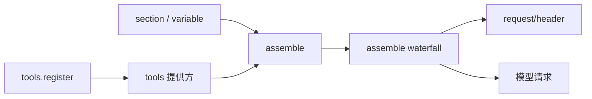

# 第 5 天 · system-prompt 与 tools

**对应阶段：** 3 中
**时长：** 5–6 小时
**今天结束时你能：** 从 `ctx.tools.register` 追到模型请求里的 tools 数组；说出三条 waterfall 各自该挂什么。

## 时间表

| 时段 | 内容 |
|---|---|
| 0:00–2:00 | system-prompt README + `src/index.ts` |
| 2:00–5:00 | tools README + types / schema / index |
| 5:00–5:30 | 对照 jsonl 的 `request/header` |
| 5:30–6:00 | 过关 + 笔记 |

---

## 一、system-prompt：每次 step 组装一次

对照：

- [`packages/core/system-prompt/README.zh.md`](https://github.com/deepseek-ai/deepseek-harness/blob/47f943859b/packages/core/system-prompt/README.zh.md)
- [`docs/subsystems/system-prompt.zh.md`](https://github.com/deepseek-ai/deepseek-harness/blob/47f943859b/docs/subsystems/system-prompt.zh.md)
- [`packages/core/system-prompt/src/index.ts`](https://github.com/deepseek-ai/deepseek-harness/blob/47f943859b/packages/core/system-prompt/src/index.ts)

循环在每个步骤调用 `ctx.systemPrompt.assemble(...)`，得到一份 `PromptAssembly`。数据怎么流到模型：



图：[architecture.md §16](./architecture.md#16-一次-assemble) · [§7](./architecture.md#7-工具流水线在-loop-外面)。

得到的 `PromptAssembly`：

```ts
{
  sections:  AssembledSection[]          // 有序文本段
  tools:     ToolSchema[]                // 模型可见的工具
  variables: Record<string, string | undefined>  // {{name}} 的值
}
```

`renderPrompt(assembly)` 做插值、丢掉空段、用空行拼接。未知 `{{var}}`、已注册但无值、格式错误的 `{{…}}` 一律抛错。明确失败，不交付坏提示词。

### 谁贡献什么

| API | 贡献 | 例子 |
|---|---|---|
| `section({ name, order, text })` | 静态 / 模板段 | `harness:identity`（order −100）、`deployment:persona`（order 0）、各工具自己的指导（100–199） |
| `context(...)` | 每次组装求值的动态上下文 | workspace 指令、时间。进入模型历史时是带 source 的 runtime-context，和 section 不是一回事 |
| `tools(provider)` | 工具 schema | `dsh-tools` 自动把自己注册成提供方 |
| `variable(name, provider)` | `{{name}}` | loop 注册 `model`、`cwd` |
| `system-prompt/assemble` waterfall | 整份组装的最后协作变换 | 监听器可以改 sections / tools；返回值具有权威性 |

作用域规则和第 4 天一样：`agent.ctx.systemPrompt.section(...)` 只对该 agent 生效，并遮蔽同名全局段。

一个 `complete: true` 的段在 waterfall **之后**变成唯一提示词（其它段被抑制）。两个 complete 段 → 组装拒绝。这是「这个 agent 完全替换系统提示词」的机制，不是日常路径。

### `toolOrder`

配置里的显式工具顺序。必须恰好包含一个 `'<unlisted-tools>'` 占位：列出的按位置排，没列出的按名字字典序插在占位处。缺省则全体按名字排序。

注册顺序不是产品顺序——那只是插件加载时序。所以顺序是中心配置，不是每个插件自己报一个权重。

### 读源码时盯什么

`assemble()` 的步骤：合并全局层与 `context.scope` 层 → 抽出 tools → 跑 waterfall → 实施 complete 约束 → 实施 runtime-context 抑制器。提供方必须能容忍裸 `assemble()`（没有 agent、没有 scope）。

---

## 二、tools：注册表 + 流水线

对照：

- [`packages/core/tools/README.zh.md`](https://github.com/deepseek-ai/deepseek-harness/blob/47f943859b/packages/core/tools/README.zh.md)
- [`docs/subsystems/tools.zh.md`](https://github.com/deepseek-ai/deepseek-harness/blob/47f943859b/docs/subsystems/tools.zh.md)
- [`docs/tool-execution-pipeline.zh.md`](https://github.com/deepseek-ai/deepseek-harness/blob/47f943859b/docs/tool-execution-pipeline.zh.md)（复习）
- 源码：[`src/types.ts`](https://github.com/deepseek-ai/deepseek-harness/blob/47f943859b/packages/core/tools/src/types.ts) → [`src/schema.ts`](https://github.com/deepseek-ai/deepseek-harness/blob/47f943859b/packages/core/tools/src/schema.ts) → [`src/index.ts`](https://github.com/deepseek-ai/deepseek-harness/blob/47f943859b/packages/core/tools/src/index.ts)

`ctx.tools` 做三件事：登记工具、决定模型看见哪些、执行时跑完整策略链。

### 从注册到模型看见

```
插件: ctx.tools.register(defineTool({...}))
        │
        ▼
注册表作为 systemPrompt.tools() 的提供方
        │
        ▼
assemble() 收集 schemas，按 toolOrder 排序
        │
        ▼
agent-loop 把 assembly.tools 放进请求
        │
        ▼
session 写下 request/header（含 system 文本和 tools 数组）
```

所以：注册工具 = 自动出现在提示词里。不用自己去改 prompt 字符串。

`schemas(scope)` 返回该 scope 可见的 schema，不含 `execute` 函数。被 `restrict` 滤掉的全局工具，`get` / `schemas` / 执行三条路径都当它不存在。

### `defineTool` 最小合同

第 2 天写过 greet。今天把合同补全：

```ts
ctx.tools.register(defineTool({
  name: 'read_file',
  description: 'Read a file from disk.',   // 模型看见的
  parameters: {
    path: { type: 'string', required: true, description: 'Absolute path' },
    limit: { type: 'number' },              // 默认可选
  },
  output: {
    schema: { type: 'string' },             // execute 的返回类型
    render: (_args, value) => [{ type: 'text', text: value }],
  },
  async execute(args, exec) {
    return readFile(args.path, { encoding: 'utf8', signal: exec.signal })
  },
}))
```

规则：

1. **参数到达 `execute` 前已经按 schema 校验。** 你还要自己查 schema 表达不了的约束（非空、正数、跨字段）。
2. **只返回规范 JSON 值。** 不要返回内容块。人类可读解释放 `output.render`。
3. **抛错或返回非法值 → `isError`。** 领域上的「命令退出码非 0」通常仍是成功值，由 renderer 解释。
4. **遵守 `exec.signal`。** 取消是协作式的。
5. **`presentCall` / `presentResult` 是纯函数。** 决定 UI 卡片（`generic` / `terminal` / `diff`）。不做 I/O，不读时钟。没有它们就回退通用卡片。第 8 天会设计一张。

`output.schema` 也是 Code Mode 的程序化 API：`await tools.read_file({ path })` 得到的是规范值，不是渲染文本。所以 schema 要像 API，不要像散文。

### 三条 waterfall + guard

| 点 | 能做什么 | 不能做什么 |
|---|---|---|
| `tools/pre-execute` | allow / deny / ask（走审批） | 改写输入参数 |
| `ctx.tools.guard()` | 单调最终拒绝 | 被后面的监听器翻案 |
| `tools/execute` | 环绕分发：超时、重试、指标 | 去掉 `signal`；只能临时替换 |
| `tools/post-execute` | 换 content 或换 value、阻止、附加上下文 | 当保密边界（换 content 挡不住读 `value`） |
| `finalizeContent` | 工具自己最后改一次 content | 异步；改 value |
| `tools/result` | 观察冻结结果 | 修改 |

权限门禁抄这段（第 8、11 天会再用）：

```ts
ctx.on('tools/pre-execute', async (exec, next) => {
  if (!(await isAllowed(exec))) {
    return { kind: 'deny', reason: 'Denied by policy.' }
  }
  return next()
})
```

### 呈现模式

配置 `tools.mode`：`native`（函数调用）/ `code`（只许 `run_code`）/ `both`。单个 agent 可用 `presentAs` 遮蔽。`run_code` 这个名字永远保留，不能注册成普通工具。

今天知道有 Code Mode 即可。jsonl 里你会看到模型调用 `run_code`，内部再 `tools.cordis_run(...)`——那是同一条执行流水线的嵌套分发。

### 并行

`isConcurrencySafe(args) === true` 才允许并行。其它（未知、抛错、未声明）一律独占。loop 用滚动池执行，`tool/result` 按模型给出的顺序写回。细节在 [第 6 天续](./day-06-loop.md) 的 `tool-calls.ts`。

---

## 三、实验：解剖一条 `request/header`

换一份带工具的短日志（仍不要用 advanced-toolchain）：

[`examples/jsonrpc-agent/tests/snapshots/bash-tool/session.jsonl`](https://github.com/deepseek-ai/deepseek-harness/blob/47f943859b/examples/jsonrpc-agent/tests/snapshots/bash-tool/session.jsonl)

取出 `request/header`（通常 `seq=6`）。不要通读提示词正文，做三件事：

1. 找到 `header.config.provider` / `model`。
2. 找到 `header.system` 的前几行。应看到 `You are an AI agent powered by DeepSeek Harness.`——这就是 order −100 的 `harness:identity`。后面的 persona、工具指导是其它 section。
3. 找到 `header.tools` 数组，列出工具名。对照 `dsh-tool-*` 包，猜每个名字来自哪个 Consumer。

再确认：这条 header **没有** `surfaceOp`。它不进 `deriveMessages()`。它是「这次请求用了什么」的锚点，供不变式和回放重建请求。

可选：读 [`packages/core/tools/tests/tools.spec.ts`](https://github.com/deepseek-ai/deepseek-harness/blob/47f943859b/packages/core/tools/tests/tools.spec.ts) 里描述 `restrict` 或 `pre-execute` 的一两段，看测试怎么描述行为。

---

## 四、过关测验

1. 工具 schema 从 `register` 到模型请求，经过哪几个对象？
2. 为什么换 content 不能当保密手段？
3. `complete: true` 的 section 在 waterfall 之前还是之后生效？为什么这个顺序重要？
4. `tools.restrict` 从普通 `ctx` 调用会怎样？
5. 权限拒绝应该改 `tool-bash` 的 `execute`，还是挂 `pre-execute`？
6. `{{cwd}}` 没人注册或值为 `undefined` 时，`renderPrompt` 会怎样？

## 五、作业

写 [05-tools-and-prompt.md](../05-tools-and-prompt.md)。用手画「register → assemble → request/header」；列出你在 jsonl 里看到的全部工具名。对照 [architecture.md §7](./architecture.md)。

## 六、明日预告

`dsh-llm` 的消息词汇，`dsh-agent` 接口 vs `dsh-agent-loop` 驱动器，对着源码走完一步 step。这是主干最重的一天：上午接口，下午驱动器；超时就在接口处停。

<details>
<summary>参考答案</summary>

1. `ToolRuntime` 作为 `systemPrompt.tools()` 提供方 → `assemble()` 得到 `PromptAssembly.tools` → loop 放进请求 → `request/header` 记下这次用的数组。
2. 换 content 只改模型看见的文本，规范 `value` 仍在，编程消费方（Code Mode）读得到。
3. 之后。waterfall 先协作改组装；complete 段再把结果收成唯一提示词。反过来的话 complete 段会被监听器改掉。
4. 抛错。restrict / presentAs 只能从 `agent.ctx` 调用。
5. 挂 `pre-execute`（或 `guard`）。改 execute 会把策略焊进能力，换执行器或复用工具时策略消失。
6. 抛错，组装失败，本步在任何模型请求前结束。

</details>
