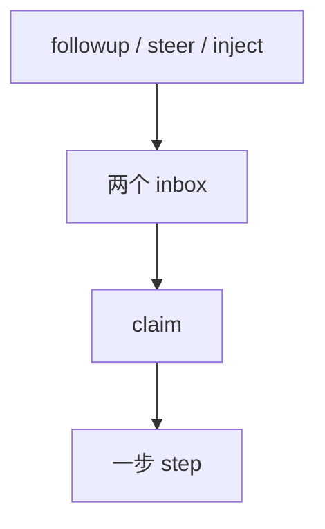

# 第 6 天续 · agent-loop

**对应阶段：** 3 下后半  
**时长：** 3–4 小时  
**前置：** 先完成 [第 6 天 · 接口](./day-06.md)。  
**今天结束时你能：** 对着 `agent.ts` / `tool-calls.ts` 走完一步 step；给一份 jsonl 写伪代码。

图：[architecture.md §4](./architecture.md#4-一轮对话-turn--step--round) · [§18](./architecture.md#18-chunk-如何变成一条-assistant-消息)。



## 时间表

| 时段 | 内容 |
|---|---|
| 0:00–2:00 | `index.ts` → `agent.ts` → `tool-calls.ts` |
| 2:00–3:20 | bash-tool jsonl 伪代码 |
| 3:20–4:00 | 过关 + 笔记 |

---

## 一、仓库里唯一的具体循环

对照：

- [`packages/core/agent-loop/README.zh.md`](https://github.com/deepseek-ai/deepseek-harness/blob/47f943859b/packages/core/agent-loop/README.zh.md)
- [`src/index.ts`](https://github.com/deepseek-ai/deepseek-harness/blob/47f943859b/packages/core/agent-loop/src/index.ts)（工厂、配置创建）
- [`src/agent.ts`](https://github.com/deepseek-ai/deepseek-harness/blob/47f943859b/packages/core/agent-loop/src/agent.ts)（`ReactLoopAgent`）
- [`src/tool-calls.ts`](https://github.com/deepseek-ai/deepseek-harness/blob/47f943859b/packages/core/agent-loop/src/tool-calls.ts)

包根不导出驱动器内部。没有 `./src/*` 逃逸路径。外面不能 `new ReactLoopAgent`。

注入恰好 5 个服务：`agents`、`sessions`、`llm`、`tools`、`systemPrompt`。

### 先读 `agent.ts` 的骨架

文件开头的 `Phase` 就是驱动器状态：

```ts
type Phase =
  | { kind: 'idle'; lastTurn: number }
  | { kind: 'maintenance'; abort; lastTurn; wakeRequested }
  | { kind: 'running'; abort; turn; step; wakeRequested }
```

读文件时按这个清单搜函数（名字以源码为准，若重构以「做这件事的函数」为准）：

1. 被 inbox 唤醒之后，如何打开 `turn/start`
2. 如何 `inbox.claim`
3. 如何发 `agent/pre-step`，如何处理 reject
4. 如何 `assemble` + `deriveMessages` + `agent/request` + `llm/stream`
5. 如何把 chunk 写成 `assistant/chunk`，再写成 `assistant/message`
6. 如何把 tool-call 交给 `executeToolCalls`
7. 何时 `step/end`，何时继续下一步，何时 `turn-stopping` / `turn/end`

对照你在第 3 天画的图。对不上就停下来：是图错了，还是你看漏了分支（reject、request-error、max-tokens）。

`agent/request-error` 是溢出恢复入口：compaction 挂在这里和 `pre-step` 压力检查，不进 loop 本体。这是「新行为不改 loop」的活证据。

### 再读 `tool-calls.ts`

模型一条 assistant 消息里可以有多个 tool-call。文件负责：

- 用 `ctx.tools.executionMode` 分成可并行 / 必须串行
- 滚动池，默认 `maxParallelToolCalls = 10`
- 每个调用先写 `tool/call`，再 `ctx.tools.execute`
- **按模型给出的顺序**写 `tool/result`，即使执行完成顺序不同
- 某个工具调用 `concludeTurn()` 后，后续调用仍可能被守卫挡住，本 step 结束后停

并行安全由工具自己的 `isConcurrencySafe` 声明，loop 不猜。

### `index.ts` 里和驱动器无关、但要知道的

配置创建的 agent：`agents: [{ id, provider, model, cwd, resumeSessionId }]`。循环 fiber 拥有它们（丢掉 handle）。`id` 是稳定 label，真正的 session id 通常是 `${label}-session-<uuid>`。

---

## 二、实验：为第一步写伪代码

用 [bash-tool session.jsonl](https://github.com/deepseek-ai/deepseek-harness/blob/47f943859b/examples/jsonrpc-agent/tests/snapshots/bash-tool/session.jsonl)（有 `tool/call` + `tool/result`）。对着第一个 step 写伪代码。模板（工具名以你读到的为准，这份 snapshot 是 `bash`）：

```
wakeup because next-turn has a user message
turn/start turn=1
claim next-step (empty) + 1 next-turn message
pre-step → enter([userMessage])
step/start turn=1 step=1
append user/message
assemble prompt + tool schemas
log request/header
agent/request → llm/stream
  append assistant/chunk (block-start, tool-call-delta, block-end, usage, finish)
append assistant/message (tool-call bash)  surface
append tool/call
tools.execute(bash) → allow → body → result
append tool/result  surface
step/end
more work? → next step or turn-stopping / turn/end
```

然后打开 `agent.ts`，在对应行旁边用注释标「这是伪代码第 N 步」。不要改逻辑，标完就丢掉。

辅助阅读：`tests/loop.spec.ts`、`tests/tool-calls.spec.ts`。测试描述的是行为，比注释更准。

---

## 三、过关测验

1. 一次并行工具调用如何保证 `tool/result` 顺序？
2. 循环依赖哪 5 个服务？少了 `systemPrompt` 会怎样？
3. `agent/request-error` 为什么不写进 `agent.ts` 的主循环分支里「直接压缩」？
4. 配置里的 `agents[].id` 是不是 session id？

## 四、作业

写 [06-agent-loop.md](../06-agent-loop.md)：一步 step 的伪代码；`agent.ts` 里打开 turn / 领取 / pre-step / 调模型 / 调工具的大概行号。

## 五、明日预告

第 7 天：从 `dsh web` 到这棵树怎么叠出来。对照 [architecture.md §2](./architecture.md#2-运行中的-dsh-是一棵插件树) · [§19](./architecture.md#19-从-dsh-web-到第一轮)。

<details>
<summary>参考答案</summary>

1. 执行可以乱序完成，写 `tool/result` 按模型给出的调用顺序。`tool-calls.ts` 保序。
2. `agents`、`sessions`、`llm`、`tools`、`systemPrompt`。缺 `systemPrompt` 则 loop 自己 PENDING，产品启动失败。
3. 压缩是挂在扩展点上的插件。主循环只暴露 `request-error`，这样换压缩策略不用改 loop。
4. 不是。`id` 是稳定 label；session id 通常是 `${label}-session-<uuid>`，除非显式给了 `sessionId`。

</details>
