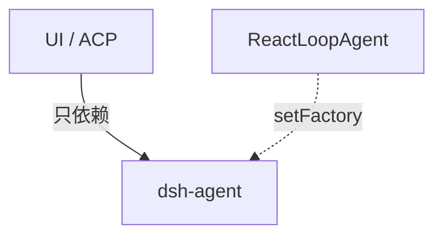

# 第 6 天 · llm 与 agent 接口

**对应阶段：** 3 下前半  
**时长：** 3–4 小时  
**今天结束时你能：** 说明为什么 UI 只依赖 `ctx.agents`；分清 `followup` / `steer` / `inject`；画出 create 事务。

**不要读 `agent-loop`。** 驱动器在 [第 6 天续 · loop](./day-06-loop.md)。先把接口钉死。

图：[architecture.md §3](./architecture.md#3-核心脊柱) · [§15](./architecture.md#15-两个-inbox) · [§17](./architecture.md#17-创建与恢复-agent) · [§18](./architecture.md#18-chunk-如何变成一条-assistant-消息)。

## 时间表

| 时段 | 内容 |
|---|---|
| 0:00–1:30 | `packages/llm/llm`：消息、chunk、适配器 |
| 1:30–3:20 | `dsh-agent`：句柄、inbox、工厂 |
| 3:20–4:00 | 过关 + 笔记 |

---

## 一、llm：循环和适配器之间的词汇

对照：

- [`packages/llm/README.zh.md`](https://github.com/deepseek-ai/deepseek-harness/blob/47f943859b/packages/llm/README.zh.md)
- [`docs/subsystems/llm-streaming.zh.md`](https://github.com/deepseek-ai/deepseek-harness/blob/47f943859b/docs/subsystems/llm-streaming.zh.md)
- [`packages/llm/llm/src/types.ts`](https://github.com/deepseek-ai/deepseek-harness/blob/47f943859b/packages/llm/llm/src/types.ts)
- [`packages/llm/llm/src/message.ts`](https://github.com/deepseek-ai/deepseek-harness/blob/47f943859b/packages/llm/llm/src/message.ts)
- [`packages/llm/llm/src/index.ts`](https://github.com/deepseek-ai/deepseek-harness/blob/47f943859b/packages/llm/llm/src/index.ts)

`dsh-llm` 同时是 Service Definition（`ctx.llm` 适配器注册表）和一批被所有人 import 的类型。DeepSeek 适配器在兄弟包 `llm-deepseek`，今天不要深挖它。

盯住三组类型：

### Message / ContentBlock

用户、助手、工具结果最后都是带 `role` 的 `Message`。内容是块列表：`text`、`tool-call`、`tool-result`、图片等。`createUserMessage` 这类工厂保证品牌化 `MessageId` 和冻结。

会话日志的 surface 投影出来的就是这些 `Message`。loop 不会另造一套「给模型的 DTO」——`deriveMessages()` 的返回值直接进请求。

### StreamChunk

适配器往上推的增量：`block-start`、`text-delta` / `tool-call-delta`、`block-end`、`usage`、`finish`。loop 用 `BlockAssembler` 收成完整 assistant 消息，同时把每个 chunk 记成 `assistant/chunk`。jsonl 里你已经见过这个形状。

### LlmAdapter

提供方实现「给定 messages + tools + config，产出 chunk 流」。注册：`ctx.llm.registerAdapter(names, adapter)`。`agent/request` waterfall 可以在调用前改 config。`llm/stream` waterfall 包在实际流外面。

loop 通过 `ctx.llm` 说话，从不 import `llm-deepseek`。换提供方 = 换注册，loop 不动。

---

## 二、dsh-agent：所有人面向的句柄

对照：

- [`packages/core/agent/README.zh.md`](https://github.com/deepseek-ai/deepseek-harness/blob/47f943859b/packages/core/agent/README.zh.md)
- [`docs/subsystems/core.zh.md`](https://github.com/deepseek-ai/deepseek-harness/blob/47f943859b/docs/subsystems/core.zh.md) 的 Agent 部分
- [`src/types.ts`](https://github.com/deepseek-ai/deepseek-harness/blob/47f943859b/packages/core/agent/src/types.ts)
- [`src/inbox.ts`](https://github.com/deepseek-ai/deepseek-harness/blob/47f943859b/packages/core/agent/src/inbox.ts)
- [`src/index.ts`](https://github.com/deepseek-ai/deepseek-harness/blob/47f943859b/packages/core/agent/src/index.ts)

**扩展插件依赖这个包，不依赖 `dsh-agent-loop`。** UI、ACP、钩子只看见 `Agent` 接口和 `ctx.agents`。

### Agent 上你真正会用的方法

| 方法 | 作用 |
|---|---|
| `followup(msg)` | 下一条用户输入，唤醒 |
| `steer(msg)` | 本轮下一步输入，唤醒 |
| `inject(msg)` | 下一步输入，不唤醒 |
| `cancel()` | 取消当前工作 |
| `ctx` | 该 agent 的 scope 上下文 |

底层是统一的 `send()`。inbox 状态机在 `Inbox` 里，并且**从会话日志的 `agent/inbox/spliced` 重建**。

`claim(target, turn)` 是 loop 的内部操作，不是插件扩展点。

### 注册表与工厂

- `ctx.agents.register` / `get` / `list` / `roots`
- `ctx.agents.setFactory(factory)`：循环启动时注册自己
- `ctx.agents.create(...)` / `resume(...)`：消费方走这里，不 new 驱动器

创建是事务：私有 session + agent + scope → setup（只注册）→ 进入两个注册表 → `session/created`、`agent/created` → `agent/session-start` → 才启动驱动器。失败则回滚。图：[architecture.md §17](./architecture.md#17-创建与恢复-agent)。

`AgentHandle = { agent, dispose() }`。`get()` 返回裸 `Agent`，观察者不能 dispose。

`CreateAgentOptions.setup(agentCtx)`：**setup 里调用 followup 是协议错误。**

### 发起方作用域

`withInitiator(agent, fn)` 用 AsyncLocalStorage 记住「谁发起的」。进程内事实；出了进程边界必须以显式字段传递。明天读 loop 碰到 `currentInitiator` 不会慌。

---

## 三、过关测验

1. 为什么 UI / ACP 面向 `ctx.agents` 编程，而不是 import `ReactLoopAgent`？
2. `deriveMessages()` 的返回值还要不要再翻译成适配器格式？谁负责翻译？
3. setup 里调用 `followup` 为什么不行？
4. `inject` 之后 agent 仍是 idle。下一次模型什么时候能看见这段上下文？

## 四、作业

写 [06-agent.md](../06-agent.md)：`Agent` vs `ReactLoopAgent` 各三句；用自己的话重画 create 事务。

## 五、明日预告

[第 6 天续](./day-06-loop.md)：唯一的具体循环，对着 bash-tool jsonl 走完一步 step。

参考答案

1. `ReactLoopAgent` 是默认可替换实现。UI / ACP 依赖 `dsh-agent` 的接口和 `ctx.agents` 工厂。
2. 不用再译一层消息。适配器消耗的就是这些 `Message`。
3. setup 时 agent 尚未发布。驱动未启动的 agent 是协议错误。
4. 下一次被 `followup` / `steer` 唤醒并领取 next-step 时，inject 的消息进入 `pre-step`。

