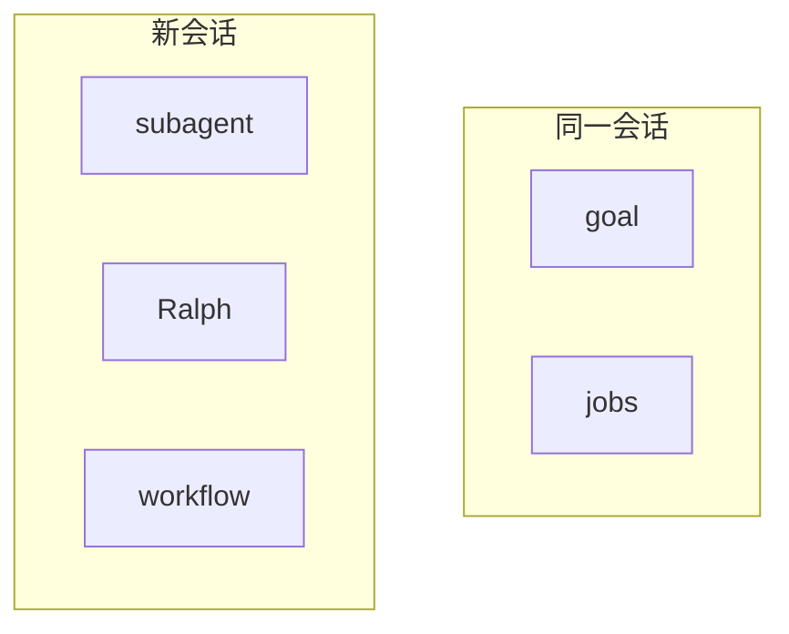
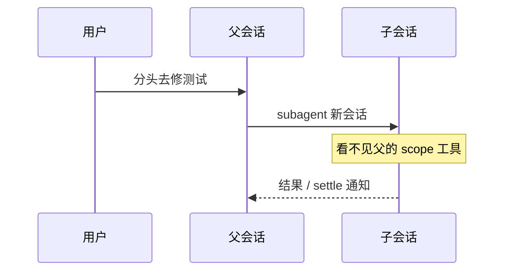
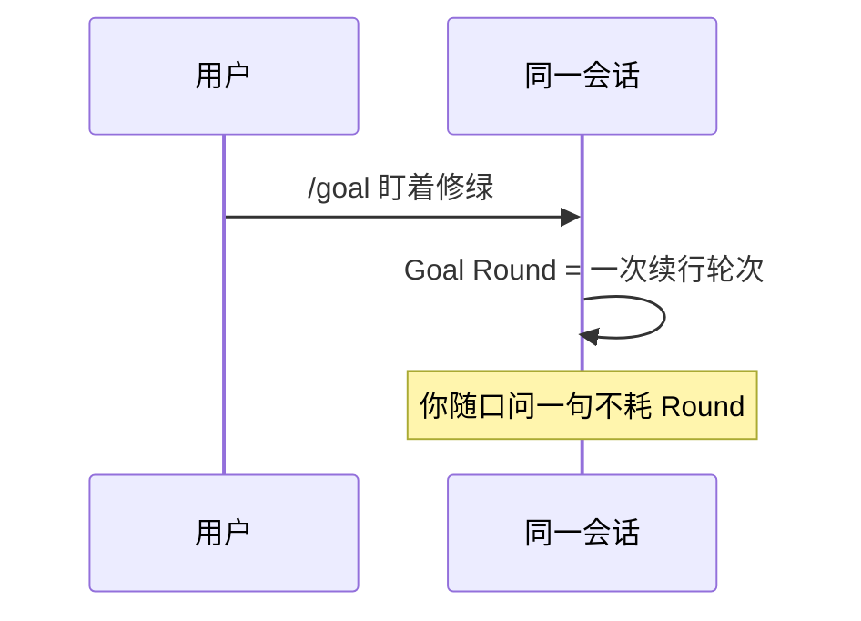

# 第 10 天 · 多智能体与工作流（进阶）

**对应阶段：** 7
**时长：** 5–6 小时
**今天结束时你能：** 用一张表对比 subagent / goal / Ralph / workflow / jobs；说明 scope 不向子 agent 继承。

## 时间表

| 时段 | 内容 |
|---|---|
| 0:00–2:00 | subagent seam |
| 2:00–3:00 | goal |
| 3:00–4:00 | Ralph vs workflow vs jobs vs preset |
| 4:00–5:00 | 读两份 snapshot |
| 5:00–5:30 | 过关 + 笔记 |

---

图：[architecture.md §10](./architecture.md#10-四条继续干活不要混) · [§14](./architecture.md#14-scope-不是谱系)。



## 一、先把五条机制钉死

它们都「让工作继续」，但继续的方式不同。

| 机制 | 是什么 | 不是什么 | 会话 | 模型怎么触发 |
|---|---|---|---|---|
| **subagent** | 把一项任务委派给另一个 agent / 产品 | 不是同会话目标 | **新**子会话（fork 可带种子） | `subagent` / `subagent_fork` |
| **goal** | 附着在**现有**会话上的持久完成目标 | 不是调度器，不是新对话 | 同一会话 | `goal_*` 工具；人类用 `/goal` |
| **Ralph** | 面向不可变目标的前台全新 agent 循环 | 不是 goal，不是通用 workflow | 每个 Round 一个**全新**子会话，无对话种子 | `ralph`（仅当人类明确要求） |
| **workflow** | worker-thread 里跑的编排脚本 | 不是 Ralph | 脚本调 `agent()` 再开子 agent | `workflow` |
| **jobs** | 通用后台任务运行时 | 不是 agent | 无独立会话 | `job_list` / `job_output` / `job_kill` |

同一句「把测试修绿」四条路，图见 [architecture.md §27](./architecture.md#27-同一句把测试修绿四条路)。





决策经验：

- 要分头干活、不想污染当前窗口 → subagent
- 当前对话里盯着一个目标继续修 → goal
- 人类点名「全新 agent 迭代，工作区当记忆」→ Ralph
- 要扇出很多同类子任务、用脚本编排 → workflow
- bash / 后台工具已经在跑 → jobs（不是新的 agent）

---

## 二、subagent

对照：[`docs/subsystems/subagent.zh.md`](https://github.com/deepseek-ai/deepseek-harness/blob/47f943859b/docs/subsystems/subagent.zh.md)、[`packages/subagent/`](https://github.com/deepseek-ai/deepseek-harness/blob/47f943859b/packages/subagent/README.md)

和 bash **不同**：同一上下文可以注册**多个**提供方，按名字选。更像 `ctx.llm` 的适配器注册表，不像单例 `ctx.shell`。

提供方例子：进程内 spawn、进程内 fork、ACP、Codex、Claude Code、dsh-sdk。Consumer：`dsh-tool-subagent`（委派）、`tool-subagent-control`（`send_message` / `interrupt_agent`）、`tool-subagent-report`（子 agent 回报）。

启动时能力用描述符 flag 声明（`outputSchema`、`depthLimit`、`toolFilter`、`persona`）。请求要了提供方没有的能力 → `UNSUPPORTED_CAPABILITY`，绝不默默忽略。

可继续子 agent 是另一条路径：由 continuation 管理器组合，用 `prepareContinuable` 是否存在来发现，不是同一个 flag。

### scope 不继承

父 `agent.ctx` 上注册的工具，子看不见。子是新的 scope key。

父子关系活在 lineage：`parentSession`、`delegationDepth`。`delegationDepth` 在 header 里，resume 才不会把孩子当成顶层。

fork 子 agent（`subagent_fork`）会把父会话**已完成轮次**做成种子，仍看不到当前未结束轮次。普通 `subagent` 默认不带对话种子，prompt 必须自包含。

默认后台跑，立刻返回可继续 id；settle 后父 agent 收到通知。`run_in_background: false` 才同步等结果。

对照：[`examples/headless-agent/tests/snapshots/subagent-settlement/`](https://github.com/deepseek-ai/deepseek-harness/blob/47f943859b/examples/headless-agent/tests/snapshots/subagent-settlement/)。看 parent / child 两份 jsonl：孩子有自己的 header、自己的 `delegationDepth`。

---

## 三、goal

对照：[`docs/subsystems/goal.zh.md`](https://github.com/deepseek-ai/deepseek-harness/blob/47f943859b/docs/subsystems/goal.zh.md)、glossary「目标」

goal 是**状态**，不是调度器。会话日志仍是真源。目标带修订号，阶段：

```
active / paused / blocked / complete
```

`blocked` 必须带稳定的 `code` + 给人看的 `message`。

**Goal Round：** 为当前目标接纳的一次续行。具体化成一个由目标触发的轮次。同会话里无关的人类轮次不消耗上限。

**激活**是进程本地的 `armed` / `disarmed`，**不参与持久回放**。恢复或 fork 之后，必须再来一次经人类授权的恢复（`/goal` 或模型工具）才能自动续跑。这是故意的：磁盘里的「active」不等于「开机接着干」。

`/goal` 是人类命令（`dsh-command-goal`），不是模型工具。模型侧另有 `dsh-tool-goal`。领域状态只有一份，两个入口。

`dsh-goal-round-driver` 通过公共 `Agent` 接口调度，不改 loop。

---

## 四、Ralph、workflow、jobs、preset

### Ralph

glossary 原文：一次面向不可变目标的**前台全新 agent** 工作流运行。由 workflow + subagent 原语组合而成，不是独立循环模式。

每个 Ralph Round：

- 新子会话
- 不接收父会话或此前子会话的对话种子
- 共享工作区是长期记忆
- 跨 Round 只传一份有界结构化 **Ralph 交接**（状态、摘要、证据、后续步骤、阻塞）

对照：[`examples/headless-agent/tests/snapshots/ralph-loop/`](https://github.com/deepseek-ai/deepseek-harness/blob/47f943859b/examples/headless-agent/tests/snapshots/ralph-loop/)。注意多个 `session.*.jsonl`。

普通「把这个目标做完」用 goal，不要用 Ralph。提示词里写得很凶：只有人类明确要求时才用 `ralph` 工具。

### workflow

对照：[`docs/subsystems/workflow.zh.md`](https://github.com/deepseek-ai/deepseek-harness/blob/47f943859b/docs/subsystems/workflow.zh.md)

脚本在 worker thread 跑，没有 fs / net / 定时器 / Node API。编排原语：`agent()`、`pipeline()`、`parallel()`、`phase()`。`ralph` 工具内部也走这套引擎，但产品语义不是「通用脚本」。

### jobs

对照：[`docs/subsystems/jobs.zh.md`](https://github.com/deepseek-ai/deepseek-harness/blob/47f943859b/docs/subsystems/jobs.zh.md)

后台 bash、后台 subagent 的「跑着的那件事」登记处。`job_*` 工具收集或杀掉。不是新的智能体。

### preset

对照：[`packages/preset/README.md`](https://github.com/deepseek-ai/deepseek-harness/blob/47f943859b/packages/preset/README.md)

按会话用一份 `cordis.yml` 组装 agent：不同工具集、不同 persona。需要独立执行世界的服务行放进 `isolate` realm。header 里的 `agentPreset` 必须和 resume 时一致，否则历史对不上能力。

---

## 五、过关测验

1. 父 agent 上注册的工具，子 agent 看得到吗？
2. Goal Round 和同会话一次普通人类轮次有何区别？
3. Ralph Round 为什么不接收父会话的对话种子？
4. 恢复一个带 active goal 的会话，会不会马上继续干活？为什么？
5. 什么时候该用 workflow 而不是连续两次 `subagent`？
6. `jobs` 和 `subagent` 都有后台，怎么选？

## 六、作业

写 [10-多智能体.md](../10-多智能体.md)。一张对比表必须自己填，不要复制今天这张。另写三个「用户说了 X，你选哪条机制」的小题并作答。

## 七、明日预告

人类通道 vs 模型通道：斜杠命令、审批、提问、plan、hooks。

<details>
<summary>参考答案</summary>

1. 看不到。scope 两层扁平，不沿 lineage 继承。
2. Goal Round 是目标策略接纳的续行，计入目标上限。普通人类轮次只是会话里另一次排空，不消耗该上限。
3. Ralph 把工作区当记忆、交接当摘要。带上父对话会把旧上下文变成隐式状态，和「全新 agent」矛盾。
4. 不会。激活是进程本地的 armed/disarmed，不回放。必须再来一次经人类授权的恢复。
5. 要扇出许多同类子任务、用脚本做 phase / pipeline / 屏障时用 workflow。一两次委派用普通 subagent。
6. 已经在跑的工具工作（bash、后台 tool）用 jobs。要另一个 agent 思考/行动用 subagent。jobs 没有自己的模型循环。

</details>
