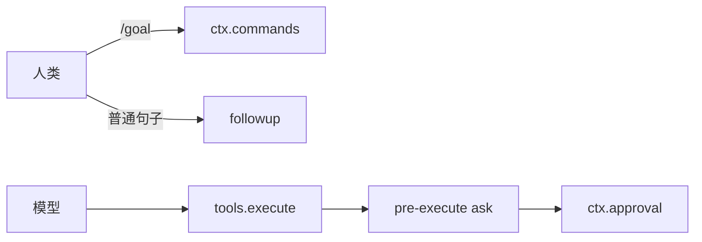

# 第 11 天 · 人机交互平面（进阶）

**对应阶段：** 8
**时长：** 4–5 小时
**今天结束时你能：** 指出一条输入该走命令还是工具；手写一个 `pre-execute` 审批门禁；解释 plan 模式为什么「只记日志」。

## 时间表

| 时段 | 内容 |
|---|---|
| 0:00–1:00 | 两条通道 |
| 1:00–2:30 | 命令、审批、提问 |
| 2:30–3:30 | plan、hooks、权限预设 |
| 3:30–4:30 | 抄门禁 + 过关 |

组入口：[`packages/interaction/`](https://github.com/deepseek-ai/deepseek-harness/blob/47f943859b/packages/interaction/README.md)。

---

图：[architecture.md §22](./architecture.md#22-人类通道与模型通道)。



## 一、两条通道

```
人类 ──斜杠命令──▶ ctx.commands ──▶ 处理器
                      │
                      │  默认只改 UI 状态
                      └─ 若处理器愿意，再改持久领域（如 /goal）

模型 ──tool-call──▶ ctx.tools.execute ──▶ 可能 ask 审批
                                              │
人类 ◀──── 审批 UI / AskUserQuestion ─────────┘
```

人类命令**不会**成为模型消息。它也不是 `ctx.shell` 里的 bash。

模型工具**必须**经过工具流水线，可能被拒绝、被问、被记入 `tool/call` + `tool/result`。

选通道的规则：

| 谁发起、想干什么 | 走哪 |
|---|---|
| 人类说 `/goal`、`/compact`、切换权限 | `ctx.commands` |
| 模型要跑 bash、读文件、委派 | `ctx.tools` |
| 模型需要人类拍板才能继续 | `tools/pre-execute` → `ask` → `ctx.approval` |
| 模型想问一个业务问题（选方案 A/B） | `ctx.askUser` / ask 工具 |
| 人类在模型跑到一半时改方向 | `agent.steer()`（不是命令） |

`/goal` 不是模型工具：人类命令观察或改当前目标；目标领域拥有每条持久且模型可见的记录。两个入口，一份状态。

---

## 二、命令平面

对照：[`docs/subsystems/commands.zh.md`](https://github.com/deepseek-ai/deepseek-harness/blob/47f943859b/docs/subsystems/commands.zh.md)

`ctx.commands`：发现、解析、分发、取消、结果渲染。适配器（Web、TUI、headless）负责把用户输入喂进来。

除非处理器**另行**改变持久领域，命令输出是 UI 状态。所以「命令回显了什么」默认不会进 `deriveMessages()`。`/goal` 之所以特殊，是因为它的处理器去改 `ctx.goals`，而 goals 自己写会话事件。

写命令插件：注册定义（名字、参数、handler），不要去 hook 模型请求。

---

## 三、审批与提问

对照：

- [`docs/subsystems/approval.zh.md`](https://github.com/deepseek-ai/deepseek-harness/blob/47f943859b/docs/subsystems/approval.zh.md)
- [`docs/subsystems/user-questions.zh.md`](https://github.com/deepseek-ai/deepseek-harness/blob/47f943859b/docs/subsystems/user-questions.zh.md)
- [`docs/subsystems/permission-presets.zh.md`](https://github.com/deepseek-ai/deepseek-harness/blob/47f943859b/docs/subsystems/permission-presets.zh.md)

### 审批是一次性的

`tools/pre-execute` 可返回 `{ kind: 'ask', reason? }`。注册表找 `ctx.approval`。没有 answerer 或无法作答 → **退化成拒绝**。部署没挂审批 seam 时，工具注册表仍然活着，只是 ask 变 deny。

`ApprovalRequest` / `ApprovalOutcome`，可按会话设策略。审计走事件。这是「这次调用能不能跑」的门，不是「模型问用户喜欢什么颜色」。

### 提问是另一条 seam

`AskUserQuestionRequest`：选项、答案词汇、提供方、错误分类。给模型一个正经的 ask 工具。不要把业务问答塞进审批。

### 权限预设

`workspace-write` / `read-only` / `full-access` 这类层。派生出 `custom` 状态。`permission/preset` 事件只记日志。真正拦操作的仍是 sandbox + `pre-execute` + fs intent 事件。预设是人类能理解的旋钮，不是新的执行器。

手抄 extension-cookbook 的门禁，改成「先 ask 再 next」：

```ts
ctx.on('tools/pre-execute', async (exec, next) => {
  if (needsApproval(exec)) {
    return { kind: 'ask', reason: 'This call writes files.' }
  }
  return next()
})
```

不要在工具 `execute` 里自己弹窗。

---

## 四、Plan 模式

对照：[`docs/subsystems/plan.zh.md`](https://github.com/deepseek-ai/deepseek-harness/blob/47f943859b/docs/subsystems/plan.zh.md)

Plan 是**仅记日志的协作状态**，不是调度器。`plan/mode` 事件记录进/出。待定选择在退出时冲刷。退出走 `exit_plan_mode` 审阅流程。

含义：模型在 plan 模式里说话、列方案；真正的副作用工具被策略挡住或改道。状态以日志为准，刷新页面还能看见「当时在 plan」。

---

## 五、Hooks

对照：[`packages/hooks/README.md`](https://github.com/deepseek-ai/deepseek-harness/blob/47f943859b/packages/hooks/README.md)、extension-cookbook「钩子系统」行。

「原生钩子」= 普通 Cordis 插件，听这些扩展点：

- `agent/session-start`
- `agent/pre-step`
- `agent/request`
- `tools/pre-execute` / `tools/post-execute`
- `agent/turn-stopping`

`dsh-hooks-claude-code` / `dsh-hooks-codex` 只是把外部钩子配置文件**映射**到这些点。新策略优先写原生插件，不要先发明一种 ini 格式。

waterfall 返回类型化决策。`turn-stopping` 是 serial，可以通过 steering 触发下一步。

---

## 六、过关测验

1. `/goal` 为什么不是一个模型工具？
2. 命令输出默认为什么只是 UI 状态？什么时候变成持久领域事实？
3. 没挂 `ctx.approval` 时，`pre-execute` 返回 `ask` 会怎样？
4. 审批和 AskUserQuestion 为什么要分成两个 seam？
5. plan 模式的状态存在哪？重启后怎么恢复？
6. 想在每次 bash 前记一条审计日志，应该听 `tools/result` 还是改 `tool-bash`？

## 七、作业

写 [11-人机交互.md](../11-人机交互.md)。画两条通道；列 4 个「用户/模型说了 X → 走哪」的例子。

## 八、明日预告

最后一天：产品表面怎么挑入口，以及改这个仓库时必须遵守的工程规矩。

<details>
<summary>参考答案</summary>

1. 它是人类命令，由 `ctx.commands` 解释，不进模型消息。模型侧另有 goal 工具。领域只有一份。
2. 命令平面默认只服务 UI。只有处理器去改 goals / session / 其它持久服务时，才产生领域事实。
3. 退化成拒绝。没 answerer 就当不允许。
4. 审批回答「这次副作用能不能发生」。提问回答「业务上选哪」。混在一起会让权限 UI 和问卷 UI 抢同一套状态。
5. 存在会话日志的 `plan/mode` 事件里。重启后从日志投影恢复，不靠内存旗标。
6. 听 `tools/result`（或 `pre-execute` 若要在执行前记）。改 `tool-bash` 会漏掉其它工具，也把审计焊进能力包。

</details>
