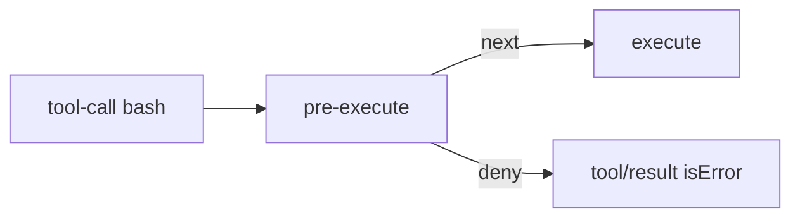
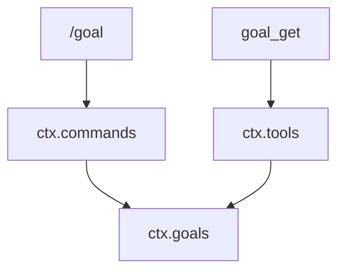

# 例子册

能抄进练习目录的最小形状。讲义讲「为什么」，本页给「长什么样」。对照 [cheatsheet](./cheatsheet.md) · [mistakes](./mistakes.md) · [compare](./compare.md)。

---

## 1. 最小 Cordis 插件

```ts
import type { Context } from '@deepseek-ai/cordis'

export const name = 'hello'
export function apply(ctx: Context) {
  console.log('hello from my first plugin')
}
```

```yaml
# tmp/cordis-tutorial/cordis.yml
- name: './hello.ts'
```

```sh
cd ../deepseek-harness/tmp/cordis-tutorial
node --import tsx ../../vendor/cordis/bin.js
```

---

## 2. 依赖服务 + waterfall 门禁

```ts
export const name = 'deny-rm'
export const inject = ['tools']

export function apply(ctx: Context) {
  ctx.on('tools/pre-execute', async (exec, next) => {
    const cmd = String(exec.arguments?.command ?? '')
    if (exec.name === 'bash' && cmd.includes('rm -rf')) {
      return { kind: 'deny', reason: 'rm -rf blocked.' }
    }
    return next()
  })
}
```



---

## 3. `--patch` 挂进 web

在 **harness 根**：

```yaml
# scratch-plugin/cordis.yml
- insert:
    - id: hello
      name: '/ABS/PATH/scratch-plugin/src/my-plugin.ts'
```

```sh
python3 -c "import os; print(os.path.abspath('scratch-plugin/src/my-plugin.ts'))"
pnpm dsh web --patch ./scratch-plugin/cordis.yml
```

相对路径会按 profile 目录解析，找不到文件。

---

## 4. 最小 `defineTool`

```ts
import { readFile } from 'node:fs/promises'
import type { Context } from '@deepseek-ai/cordis'
import { defineTool } from '@deepseek-ai/dsh-tools'

export const name = 'word-count'
export const inject = ['tools']

export function apply(ctx: Context) {
  ctx.tools.register(defineTool({
    name: 'word_count',
    description: 'Count words in a UTF-8 file.',
    parameters: {
      path: { type: 'string', required: true, description: 'Absolute path' },
      limit: { type: 'number' },
    },
    output: {
      schema: {
        type: 'object',
        properties: {
          words: { type: 'number' },
          chars: { type: 'number' },
        },
      },
      render: (_args, value) => [{ type: 'text', text: `${value.words} words` }],
      presentationMeta: (_args, value) => ({ words: value.words, chars: value.chars }),
    },
    presentCall: (args) => ({ card: 'generic', title: `count ${args.path}`, kind: 'search' }),
    presentResult: (_args, result) => ({
      card: 'generic',
      title: result.isError ? 'count failed' : `${result.meta?.words ?? '?'} words`,
    }),
    async execute(args, exec) {
      const text = await readFile(args.path, { encoding: 'utf8', signal: exec.signal })
      const words = text.split(/\s+/).filter(Boolean).length
      return { words, chars: text.length }
    },
  }))
}
```

`execute` 返回规范 JSON，不返回散文。卡片必须是纯函数。`presentResult` 的第二个参数是 `{ content, isError, meta? }`，**不是** `execute` 的返回值；给卡片用的数字走 `output.presentationMeta` → `result.meta`。`readFile` 来自 Node；不要在 `execute` 里写权限策略。

---

## 5. request / spec

```ts
// 调用方：意图，字段多半可选
const request = { command: 'ls', timeoutMs: undefined }

// 拥有方：补齐、校验、冻结
const spec = resolve(request)
// spec.timeoutMs 一定有值

await ctx.shell.run(spec)
```


不要在 `run()` 里写 `timeoutMs ?? 30_000`。

---

## 6. 三个入口各举一句

| 谁 | 代码 | 队列 |
|---|---|---|
| 用户打字 | `agent.followup(userMessage)` | next-turn，唤醒 |
| 审批通过后续跑 | `agent.steer(userMessage)` | next-step，唤醒 |
| 文件监视器塞上下文 | `agent.inject(ctxMessage)` | next-step，**不**唤醒 |

```ts
// inject 之后必须再有 followup / steer，否则 agent 一直 idle
await agent.inject(createUserMessage({
  content: [{ type: 'text', text: 'AGENTS.md changed.' }],
  source: { kind: 'plugin', plugin: 'watch' },
}))
```

---

## 7. 人类命令 vs 模型工具

```text
用户输入 /goal show     →  ctx.commands，不进 deriveMessages
模型调用 goal_get       →  ctx.tools，写 tool/call + tool/result
两者改的是同一份 ctx.goals
```



---

## 8. patch 整份替换

```yaml
# 错：只写一个字段，其它 bundle 默认值丢掉
- id: tools
  config:
    mode: code

# 对：改 mode 时重述该条目要保留的字段（以 dump-config 里那一行为准）
- id: tools
  config:
    mode: code
    # ... 其余原字段
```


---

## 9. 读日志的三行脚本

在 `../deepseek-harness`：

```sh
python3 -c '
import json,sys
p=sys.argv[1]
for i,line in enumerate(open(p)):
    o=json.loads(line)
    t=o.get("type","?")
    extra=""
    if t in ("user/message","assistant/message","tool/result"):
        extra=" surface"
    print(f"{i:02d} {t}{extra}")
' examples/jsonrpc-agent/tests/snapshots/text-turn/session.jsonl
```

先 text-turn，再 bash-tool。不要先打开 advanced-toolchain。
