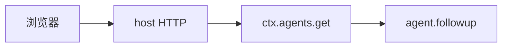
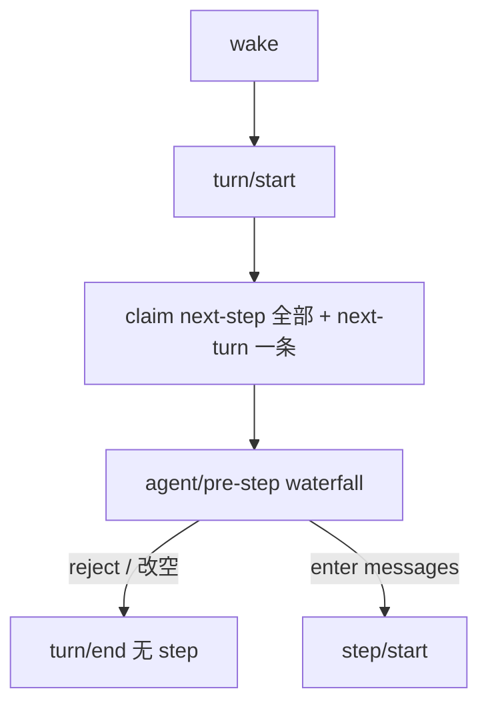

# 一次请求跟读

把第 3–6 天串成一条线。假设 Web 里用户发送：`List files in the workspace.` 模型决定调用 `bash`。

对照 [architecture.md §4](./architecture.md#4-一轮对话-turn--step--round) · [§7](./architecture.md#7-工具流水线在-loop-外面) · [§16](./architecture.md#16-一次-assemble)。

---

## 0. 谁在说话



Host 不实现循环。它拿到 `Agent` 句柄，调用 `followup`。

---

## 1. 进 inbox

`followup` 往 **next-turn** 追加一条 `UserMessage`，并唤醒驱动器。日志先写 `agent/inbox/spliced`（插入），再发实时 `agent/inbox/inserted`。

`inject` 不会走到这里：它进 next-step，不唤醒。

---

## 2. 打开轮次并领取

驱动器从 `idle` 进入 `running`：

1. `turn/start { turn: 1 }`
2. `claim`：清空 next-step（可能有上次留下的 inject），再取 **一条** next-turn
3. 领取是纯删除 splice，每条再发 `agent/inbox/claimed`



策略（压缩压力、钩子）可以在 `pre-step` 改写或拒绝。拒绝后消息不回 inbox，但轮次仍记下这次尝试。

---

## 3. 记用户消息、组装请求

`step/start` 之后，enter 的消息写成 `user/message`（`surfaceOp: append`）。这是模型历史的第一条。

然后 `systemPrompt.assemble`：

- 段：harness 身份、persona、各工具指导
- 工具 schema：来自 `ctx.tools` 这个提供方
- 变量：`{{cwd}}`、`{{model}}`

结果写进 `request/header`（**没有** surfaceOp，不进 `deriveMessages`），再经 `agent/request` waterfall 交给 `ctx.llm`。

---

## 4. 流式块变成一条 assistant 消息

适配器吐出 `block-start` → `tool-call-delta` → `block-end` → `usage` → `finish`。每一段都是 `assistant/chunk`。`BlockAssembler` 收成一条 `assistant/message`（surface）。

模型这次的内容是一个 tool-call：`bash { command: "ls", description: "List workspace files" }`。

---

## 5. 工具在 loop 外面跑

循环只写 `tool/call`，然后 `ctx.tools.execute`：

```text
pre-execute  →  guard  →  execute 环绕  →  tool-bash.execute
    →  ctx.shell.run(spec)  →  post-execute  →  tools/result
    →  循环写 tool/result（surface）
```

权限若 deny，`execute` 主体不跑，模型仍收到一条失败形态的 `tool/result`。

`bash` 的规范值类似 `{ kind: "foreground", exitCode: 0, stdout: { text: "…" } }`。`output.render` 把它变成给模型看的文本，并带 `[exit code: 0]`。

---

## 6. 下一步或结束

`step/end`。工具结果还欠一次模型请求 → 再 `claim` next-step（通常空）→ `pre-step` → step 2。第二次模型只回文本，没有 tool-call → `agent/turn-stopping` → `turn/end` → `idle`。

UI 全程听 `session/event` 画卡片，听 `agent/status` 显示 running / idle。

---

## 7. 对照一份真日志

[bash-tool session.jsonl](https://github.com/deepseek-ai/deepseek-harness/blob/47f943859b/examples/jsonrpc-agent/tests/snapshots/bash-tool/session.jsonl) 就是这条链（入口是 JSON-RPC 而不是 Web，后面相同）。

用第 4 天的 python 小脚本列出 `type`，按上面 1–6 标号。

---

## 8. 你若要拦这一次 ls

不要改 `tool-bash`。挂：

```ts
ctx.on('tools/pre-execute', async (exec, next) => {
  if (exec.name === 'bash' && String(exec.arguments.command).includes('ls')) {
    return { kind: 'deny', reason: 'lab policy' }
  }
  return next()
})
```

这就是第 8 天作业的形状。
